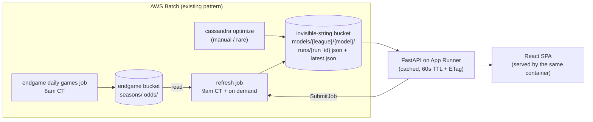

# invisible-string

A small webapp over [cassandra](https://github.com/NathanDeMaria/cassandra) model
results: current ratings per league, and win probability / predicted spread for a
hypothetical matchup.

```
infra/      terraform: ECR, App Runner service, Batch refresh job, IAM
backend/    FastAPI, depends on cassandra as a git dependency
frontend/   React + Redux Toolkit (RTK Query), built into backend's static dir
```

---

## 1. What cassandra gives us today

Worth being precise about this, because most of the design follows from the gaps.

**Ratings** live inside a predictor instance as a plain dict, with a shape that
varies by class:

| Predictor | rating shape | extra state |
|---|---|---|
| `EloPredictor` | `dict[str, float]` | `home_advantage`, `k` |
| `Elo538Predictor` | `dict[str, float]` | `home_advantage`, `k`, prior manager |
| `GlickoPredictor` | `dict[str, (rating, rd)]` | `home_advantage`, `k`, RD inflation params, `scoring_method`, prior manager |
| `FlatPredictor` | — (returns 0.5) | — |

`save_state(path)` writes that to local JSON; `load_state(path)` reads it back.
`evaluate_models.py` is the only thing that calls `save_state`, and it writes to
`~/.cassandra/models/<league>/<name>_result_state.json` — **on the machine that ran
the job**. Nothing about ratings currently reaches S3.

### 1a. Ratings didn't move on `main` — fixed (§9.1)

> **Resolved upstream.** Kept because it explains why the rest of this document
> assumes ratings are a real fold, and why any parameters tuned before the fix
> are worth re-optimizing.

`generate_predictions` — the one loop every pipeline runs through — called
`predictor.predict_game(game)`. Since commit `0f93c96` ("Split 'update' and
'predict'", March 2026), `predict_game` is the *pure* half: it reads ratings and
returns a probability without mutating anything. `update_game` is the half that
learns, and **nothing outside the unit tests called it.**

That commit refactored all four predictors and all four test files, but didn't touch
`save_predictions.py`. So the caller kept calling what had become the read-only
method. The consequences, while it lasted:

- `EloPredictor` started with `ratings or {}` and every team stayed at 1500 forever;
  its win probability was a constant determined only by `home_advantage`.
- `Glicko`/`Elo538` stayed pinned at whatever `OpponentPriorManager` loaded, and
  `postrun_callback` then saved "final" priors computed from ratings that never moved.
- In `optimize.py`, `k` could not affect the Brier objective at all, because nothing
  ever applied it. Only `home_advantage` did anything.

What this design takes from it: ratings are a genuine fold over the game sequence, so
a rating timeseries is meaningful and the incremental refresh in §5a is exact. Both
are true now, and neither was before the fix — which is why the artifacts worth
publishing are the ones produced after it.

### 1b. Games were walked in fetch order, not chronological order — fixed (§9.3)

`generate_predictions` iterated `season.weeks` and `week.games` directly. endgame's
own docstrings are pointed about this: *"Prefer this over `.weeks`: the raw list's
order depends on how the season happened to be built and merged, so it isn't
reliably chronological."*

NCAABB seasons carry `season_start = REGULAR_SEASON_START = (11, 1)`, and per the
`Season` docstring that means `.weeks` is *only a record of how the games were
fetched* — the chronological view is `calendar_weeks`, rebuilt from game dates,
precisely because source weeks "can still overlap in time." `iter_weeks()` exists to
walk this correctly and raises `OverlappingWeeksError` when they do overlap.

So `pass_week()` fired on boundaries that could overlap in time, over games in an
arbitrary order. `generate_predictions` now sorts seasons by year and walks
`iter_weeks(season)` / `week.games_in_order`, which is what everything below
assumes — a rating timeseries needs a meaningful x-axis, and a fold is only
reproducible if its sequence is deterministic.

**Predictions** are `predict_game(matchup: Matchup) -> Prediction(team1_win_prob)`.
`Matchup` is a Protocol — the pre-game half of a game (`home`, `away`,
`neutral_site`, `date`, `game_id`) — which `Game` satisfies structurally. So a
hypothetical matchup needs no synthetic `Game` with fake scores, and an
implementation taking a `Matchup` can't peek at the results. `update_game` is the
half that takes a whole `Game` and learns from it.

**Margins are not part of the predictor.** They're a separate fit, and one that
changed shape after this document was first written. Historically `evaluate_model`
fit an `IsotonicRegression` from win prob → **market spread** with
`increasing=False`, used it for against-the-spread accuracy, and then threw it
away — no persisted mapping anywhere, which was the single biggest gap for the
matchup feature.

Since cassandra's `e80ef85` it fits win prob → **margin of victory**,
`increasing=True`, and persists it (§9.2). Two consequences worth stating plainly:

- **It trains on every game with a final score**, not the ~20% a book hung a line
  on. That's five times the data, and it stops the calibration inheriting the
  market's coverage bias — books price the games people bet on.
- **The sign flipped.** Both threshold lists now ascend, and a higher win
  probability means a *more positive* number: the home team wins by more. The
  display convention below did not change; the API just negates at the boundary.

**Everything is expensive.** `read_all_seasons` pulls 16 years of season pickles;
`OddsDatabase.from_s3` lists and reads *every* odds key in the bucket. This is
minutes of work and hundreds of MB. It must never happen inside a request.

**Sign conventions** (adopt these verbatim so nothing flips):
- `team1` == home. `team1_win_prob` is the home team's win probability.
- `spread` is the market handicap applied to home: `team1_covered = spread + (home_score - away_score) > 0`. So **negative spread = home favored**, and a
  predicted spread of `-6.5` renders as "Duke -6.5".
- `margin` is the plain difference, `home_score - away_score`, so **positive
  margin = home won**. It is the negation of the spread, which is why the one
  line in §3 that converts between them is worth reading twice.

---

## 2. The core decision: a `ModelRelease` artifact in S3

The webapp never runs the model. A batch job produces a self-contained,
versioned JSON artifact; the API reads it, caches it, and serves everything from
it. This is the contract between cassandra and the webapp, and it's the only one.



Why an artifact rather than the API loading predictor state directly: it lets the
API stay ignorant of predictor internals, it makes "which model is live" an
explicit, revertible pointer, and it gives the refresh job an idempotency
watermark to work against.

### Schema

Defined as pydantic in cassandra (`cassandra/serving/release.py`), imported by the
backend — one definition, no drift.

```jsonc
{
  "schema_version": 1,
  "run_id": "2026-08-08T09:00:12Z",          // also the S3 object name
  "league": "mens",
  "model": "glicko_tuned",                    // config stem from optimize.py
  "predictor_class": "GlickoPredictor",

  // exactly what save_state() writes, minus ratings — enough to rebuild the
  // predictor for predict_game()
  "params": { "home_advantage": 95.0, "k": 65.0, "initial_rd": 216.0,
              "scoring_method": "binary", "weekly_rd_increase": 1.0,
              "season_rd_increase": 120.0 },

  "ratings": {
    "Duke": { "rating": 1834.2, "rd": 71.4, "wins": 24, "losses": 5 },
    "…":    { "rating": 1500.0, "rd": 216.0, "wins": 0, "losses": 0 }
  },

  // win prob -> margin of victory. A union discriminated on `kind`, because
  // cassandra's DEFAULT_FITTERS scores more than one and stores the winner.
  // Serialized as parameters, never as a pickled estimator: serving needs
  // np.interp and nothing else, and a scikit-learn upgrade can't make old
  // releases unreadable.
  "margin_calibration": {
    "kind": "isotonic",
    "x_thresholds": [0.0803, 0.0867, ...],  // ascending win probs
    "y_thresholds": [-14.69, -14.69, ...]   // ascending margins (increasing=True)
  },
  // or: { "kind": "logistic", "scale": 11.83 } — isotonic flattens outside the
  // win probs the season contained; logistic keeps extrapolating, which is the
  // lopsided-matchup case §3 clamps for.

  "metrics": { "brier_score": 0.1782, "margin_mae": 9.4,
               "against_spread_accuracy": 0.514,
               "spread_game_margin_mae": 9.1, "market_margin_mae": 8.8,
               "n_games": 98342, "n_spread_games": 21150 },

  "trained_through": {
    "season_year": 2026,
    "last_game_date": "2026-08-07T23:15:00Z",
    "processed_game_ids": ["401710...", "..."]  // current season only
  },

  "created_at": "2026-08-08T09:00:12Z",
  "created_by": "refresh|optimize|post",
  "parent_run_id": "2026-08-07T09:00:08Z"      // null for a full retrain
}
```

### Reading the metrics

`brier_score` stays the selection rule (§11.1) — it's over every game and it's what
the optimizer targets. The three MAEs are margin errors in points, and two of them
are only meaningful as a pair:

| Field | Over | Says |
|---|---|---|
| `margin_mae` | every game with a final score | how far off the margin fit is, on its own terms. Not comparable across leagues, and not comparable to anything else. |
| `spread_game_margin_mae` | just the games a book priced | the model's error on that subset |
| `market_margin_mae` | the same subset | the closing line's error on it |

The signal is the **gap** between the last two. `margin_mae` alone means very little
— it's measured on a different, larger population than the market number, so
comparing them directly flatters the model on exactly the games nobody was willing
to price. The bottom two are None for a league with no odds coverage, because
cassandra maps nan to null on the way out: `json.dumps` writes nan as a bare `NaN`
token that isn't valid JSON and that `JSON.parse` rejects.

Layout, in this repo's own bucket (§11.2): `models/{league}/{model}/runs/{run_id}.json`
plus `models/{league}/{model}/latest.json` (a copy, not a pointer — one GET to serve).
Keeping every run means rollback is `aws s3 cp runs/<old>.json latest.json`.

Discovering which models exist for a league is a `ListObjectsV2` on
`models/{league}/` delimited at `/`, then one GET per `latest.json`. At a handful of
models per league that's fine behind the §3 cache, and it's why the instance role
needs `ListBucket` and not just `GetObject`.

`ratings` includes W-L because the refresh job already has the season in memory and
the API otherwise would have to read season pickles just to fill a table column.

---

## 3. Backend (`backend/`)

FastAPI, depends on cassandra as a git dep the same way cassandra depends on
endgame. Python 3.14 (cassandra pins `^3.14`).

```
backend/
  app/
    main.py            # app factory, static mount + SPA fallback
    api/
      ratings.py
      predict.py
      admin.py
    releases.py        # S3 fetch + in-process cache
    settings.py        # pydantic-settings: bucket, batch queue/def, admin token
  Dockerfile           # multi-stage: node build → python runtime
  pyproject.toml
```

### Endpoints

```
GET  /api/leagues
       -> [{league, models: [{name, is_default, run_id, created_at, metrics}]}]
       # is_default = lowest metrics.brier_score for the league (§11.1)

GET  /api/leagues/{league}/ratings?model=&limit=&offset=
       -> {run_id, created_at, trained_through, metrics,
           ratings: [{rank, team, rating, rd?, wins, losses, delta_7d?}]}

GET  /api/leagues/{league}/history?model=&teams=Duke,UNC&from=&to=      # §6
       -> {series: [{team, points: [{year, week, date, rating, rd}]}]}

GET  /api/predict?league=&model=&home=&away=&neutral=false&home_advantage=
       -> {home, away, neutral, home_win_prob, away_win_prob,
           predicted_spread, home_rating, away_rating, run_id, model}

POST /api/admin/releases            (auth)  # push a run from a laptop
POST /api/admin/refresh             (auth)  -> {job_id}
GET  /api/admin/refresh/{job_id}    (auth)  -> {status, ...}

GET  /healthz   /readyz
```

`predict` is a **GET** on purpose: a matchup is a shareable, cacheable, linkable
thing, and RTK Query caches it for free. `home_advantage` is an optional override
for what-ifs — it's a constructor kwarg on every predictor, so it costs nothing to
support.

### How `predict` works

1. Fetch the cached `ModelRelease`.
2. `release.to_predictor()` — rebuilds e.g. `GlickoPredictor(league, **params, ratings=...)`.
3. `predictor.predict_game(matchup)`. This got simpler than originally written:
   `predict_game` now takes a `Matchup` — a Protocol in
   `cassandra/predictor/types.py` covering "the part of a game that's known before
   it's played" (`home`, `away`, `neutral_site`, `date`, `game_id`). `Game`
   satisfies it structurally, so no synthetic `Game` with fake scores is needed, and
   an implementation taking a `Matchup` *cannot* reach the results even by accident.
4. **Negate at the boundary.** The calibration predicts margin; the wire format is
   the market's spread.

   ```python
   predictor = release.margin_predictor()   # None if the release carries no fit
   margin = float(predictor.predict_margins(np.array([p]))[0])
   predicted_spread = -margin               # renders as "Duke -6.5"
   ```

   `margin_predictor()` rehydrates whichever fitter won — `np.interp` over the
   knots for the isotonic one, `scale * logit(p)` for the logistic one. It
   returns `None` when `margin_calibration` is null, which is a real case: a
   release written before the fit existed, or a predictor flat enough that there
   was no slope to fit. `/api/predict` should answer with the win probability and
   omit the spread rather than 500.

   Don't reimplement the evaluation here. Storing the fit as parameters is what
   lets reading it work without scikit-learn — it isn't an invitation for every
   caller to reinvent `np.interp`. The isotonic predictor also clamps outside the
   fitted range, where `IsotonicRegression` itself returns `nan`; a season only
   spans roughly `[0.05, 0.95]`, so a lopsided matchup lands outside it and the
   nan would surface as a blank number a long way from here.

   This image genuinely cannot fit, by construction: cassandra keeps
   scikit-learn in a poetry `fit` group, and poetry groups aren't part of package
   metadata, so the git dependency doesn't pull it in and
   `IsotonicProbToMarginFitter.fit` imports it lazily. A `No module named sklearn`
   here therefore always means code is trying to *fit* rather than to *read* a
   fit; the fix is never to add sklearn.

Rebuilding the predictor per request is microseconds — it's a dict assignment. Cache
the constructed predictor per `run_id` anyway.

### Caching

In-process, keyed by `(league, model)`, 60s TTL, refreshed with a conditional GET on
`latest.json`'s ETag. That makes multiple Fargate tasks converge within a minute of
any write without needing shared state, a cache-bust endpoint, or sticky routing.
Ratings change at most once a day.

### Auth

Single bearer token from Secrets Manager, checked by a FastAPI dependency on
`/api/admin/*`. Everything else is public read. If you'd rather not have a public
write path at all, drop `POST /api/admin/releases` — the jobs already write to S3
directly with their own role (see §5).

---

## 4. Frontend (`frontend/`)

Vite + React + TypeScript + Redux Toolkit. **All server data through RTK Query** —
the whole app is a server cache with two filters on top; hand-rolled thunks would be
pure overhead. Plain slices only for UI state.

```
frontend/src/
  app/store.ts
  services/api.ts          # RTK Query: getLeagues, getRatings, getPrediction
  features/ratings/        # RatingsTable, league picker, search
  features/matchup/        # team comboboxes, neutral toggle, ResultCard
  ui/                      # shared bits
```

Three routes:

- **`/ratings/:league`** — sortable table (rank, team, rating, RD, W-L, 7-day
  change). TanStack Table for sort/filter. ~360 D1 teams per league, so virtualize
  the rows but don't paginate — a scannable single list is the point. Row selection
  feeds the compare chart.
- **`/history/:league`** — rating-over-time lines for the selected teams, defaulting
  to the current season with a range picker back through 2010. Time on the x-axis,
  not week number (§6). Reachable from the ratings table with teams preselected, and
  team-keyed in the query string so a comparison is shareable.
- **`/matchup`** — two team comboboxes fed from the ratings response already in the
  RTK Query cache (no extra endpoint), a neutral-site toggle, and a result card:
  win probability for each side plus the spread rendered in familiar form
  ("Duke -6.5"). Mirror the form state into the query string so a matchup is a
  shareable link.

Header carries model + `trained_through` date, so it's always obvious how fresh the
numbers are.

Build output goes into the backend image and is served by FastAPI `StaticFiles` with
an SPA fallback — one container, one deploy, no CORS, no CloudFront. Worth splitting
later only if the frontend starts needing its own release cadence.

---

## 5. Update paths

Three ways a new release appears, all producing the same artifact.

### a. Nightly refresh (the "live update" feature)

EventBridge Scheduler → Batch, 9am CT, after endgame's 8am games job.

1. Read `latest.json` for each `(league, model)`.
2. Rehydrate the predictor from `ratings` + `params`.
3. Read **only the current season** from S3 (`seasons/{year}/{gender}.pkl`) — not all 16.
4. Take completed games whose `game_id` is not in `processed_game_ids`, walk them in
   `iter_weeks` / `games_in_order` order, calling `update_game`, with `pass_week()` at
   week boundaries.
5. Recompute W-L, write a new run, flip `latest.json`.

**This is exact, not an approximation.** Elo, Elo538 and Glicko updates are a pure
fold over the game sequence, and Glicko's RD inflation is per-week/per-season — so
incrementally applying today's games to yesterday's state gives bit-for-bit what a
full replay would, *provided* the games go in the same order and week boundaries are
honored. Two things to be careful about:

- **Never call `postrun_callback()` in this job.** It calls
  `OpponentPriorManager.save`, which raises if the priors file already exists, and
  those priors are a full-history artifact that a daily job has no business rewriting.
  `update_game` also calls `_prior_manager.add_game`, but that's in-memory counting
  only — harmless.
- **`processed_game_ids`, not a timestamp watermark.** Games get re-fetched and
  scores corrected; endgame's own `calendar_weeks` de-dupes by `game_id` for exactly
  this reason. An id set makes the job idempotent and safe to re-run.

Guardrail: a weekly full replay that diffs against the incremental ratings and alerts
on divergence beyond a threshold. Cheap, and it catches an ordering bug before it
compounds over a season.

### b. Admin-triggered refresh

`POST /api/admin/refresh` calls `batch:SubmitJob` on the same job definition and
returns the job id; `GET /api/admin/refresh/{job_id}` polls `DescribeJobs`. The API
stays small, no long work in the web task, and it reuses infra that already exists.

### c. Posting a new model run

After `optimize.py` / `evaluate_models.py`, you have a fresh model. **Preferred: the
job writes the release to S3 itself** — it already holds S3 credentials via the Batch
job role, and then there is exactly one write path and no "which source wins"
question. `POST /api/admin/releases` is a thin authenticated wrapper doing the same
write, for pushing a run from a laptop that isn't running in Batch. Both validate
against the same pydantic model. A posted run always starts a fresh lineage
(`parent_run_id: null`), and the next nightly refresh continues from it.

---

## 6. Rating history per team

The predictor callbacks are the right seam for this — `pass_week()` is already
invoked at exactly the granularity a chart wants, on every pipeline run, for free.
Two changes make it usable.

### The `ratings` accessor

`Predictor` has no way to read ratings out. `get_rating` is defined per subclass with
incompatible return types (`float` for Elo/Elo538, `_Rating` for Glicko) and doesn't
exist at all on `FlatPredictor`. So the base class needs a normalized view:

```python
class TeamRating(NamedTuple):
    rating: float
    rd: float | None = None

class Predictor(ABC):
    @property
    def ratings(self) -> dict[str, TeamRating] | None:
        """None for predictors that don't rate teams."""
        return None
```

`None` doubles as the capability flag from §9.8 — it's what tells the ratings table
and the history job to skip `FlatPredictor`.

### An observer, not an overridden callback

The tempting move is a wrapper `Predictor` that overrides `pass_week()` to snapshot.
I'd avoid it: `pass_week` is part of the *model's* contract — it's where Glicko
inflates RD — so a snapshot taken inside it is ambiguous about whether it lands
before or after that inflation, and a wrapper has to reimplement the whole ABC to
delegate. Instead, hang an optional observer off the traversal, where the call site
controls ordering:

```python
def generate_predictions(
    predictor, seasons, post_callbacks=False, week_observer=None
) -> Iterator[GameResult]:
    for season in seasons:
        for week in iter_weeks(season):              # §1b
            for game in week.games_in_order:
                prediction = predictor.update_game(game)   # §1a
                yield GameResult(prediction, game, season.year, week.number)
            if week_observer:
                week_observer(season.year, week.number, predictor.ratings)
            predictor.pass_week()
        predictor.pass_season()
```

Snapshotting *before* `pass_week`/`pass_season` means each point is "the rating this
team finished that week with," which is what you want to plot. `pass_season()` is
then the natural place to capture end-of-season finals — worth keeping deliberate,
since Glicko's big RD reset happens there, so a post-`pass_season` reading is next
season's *starting* state, not this season's result.

### Storage

Long format, one file per `(league, model)`:
`models/{league}/{model}/history.parquet` with columns
`team, year, week, rating, rd, run_id`.

All seasons back to 2010 (§11.3). Sizing: ~360 teams × ~20 weeks × 16 seasons ≈ 115k
rows per model. That's a couple of MB as Parquet — small enough that the API loads
the whole thing once and caches it alongside the release, and small enough that
per-team files (360 S3 puts, N requests to compare three teams) aren't worth it.

The two producers split cleanly along the same line as §5:

- **Full replay** (retrain, or the weekly guardrail) rewrites `history.parquet` end
  to end — it's the only thing that *can*, since it's the only thing that walks all
  16 seasons.
- **Daily refresh** upserts the current `(team, year, week)` rows. Upsert rather than
  append because ratings move within a week as games land, and the job must stay
  idempotent.

This also subsumes the `delta_7d` column in the ratings table — with history on hand
it's a lookup, not a diff against yesterday's release, so releases don't need to be
retained just to compute it.

### Serving it

```
GET /api/leagues/{league}/history?model=&teams=Duke,UNC&from=2025&to=2026
    -> {series: [{team, points: [{year, week, date, rating, rd}]}]}
```

Team-filtered, because the useful view is 2–5 teams overlaid, not 360. On the
frontend it's a line chart on the team detail route plus a "compare" affordance from
the ratings table (select rows → chart them). Include a real `date` per week
alongside `(year, week)` so the x-axis is time rather than an integer that resets
every November.

## 7. Infra (`infra/`)

Follows the endgame `jobs/` conventions: `us-east-2`, S3 backend in the
`nathan-terraform` bucket (key `invisible-string/terraform.tfstate`), a `Makefile`
with `plan`/`apply`, `scheduled_job`-style module for the Batch piece.

### App Runner instead of Fargate + ALB

**What it is:** point it at a container image in ECR and it runs it — no ECS cluster,
no task definition, no load balancer, no target groups, no VPC. It hands back an
HTTPS URL on a managed certificate, autoscales on concurrent requests, and does
rolling deploys when the image tag moves. Effectively "Fargate with the networking
already solved."

What it replaces from the previous sketch: the ALB, the ACM cert, the target group,
the listener rules, the ECS cluster and service, the security groups, and the subnet
wiring. That's most of the terraform.

The mapping from the Fargate concepts is close to one-to-one:

| Fargate + ALB | App Runner |
|---|---|
| task role | `instance_role_arn` — same thing, same IAM policies |
| execution role (ECR pull) | `access_role_arn` on the image repository config |
| ALB + ACM + Route53 alias | `aws_apprunner_custom_domain_association` (managed cert, you add the DNS validation records) |
| target group health check | `health_check_configuration` → `/healthz` |
| desired count / autoscaling | `aws_apprunner_auto_scaling_configuration_version` |

**The reason it's actually a better fit, not just cheaper:** §3's caching design
assumes a long-lived process holding the release JSON and `history.parquet` in
memory. App Runner keeps a warm container, so that holds. This is also why I'd steer
away from the Lambda + Mangum option I mentioned earlier — per-invocation cold starts
would mean re-reading multi-MB artifacts from S3 constantly, and the whole caching
story would have to be rebuilt around something external.

**Cost:** roughly $5–10/mo at 1 vCPU / 2 GB, billed as a low idle rate on provisioned
memory plus compute only while serving requests. Versus ~$16/mo for the ALB alone
before any compute. One caveat worth knowing up front: App Runner's minimum is 1
instance — there's no automatic scale-to-zero, only a manual "pause". So the floor is
a few dollars a month, not zero.

**Things to know before committing:**
- One HTTP port, which is exactly what the single-container design in §4 produces.
- Default egress is the public internet, which is fine — S3 and Batch are public
  endpoints. A VPC connector is only needed for private resources, and there are none
  here.
- Custom domain validation is a CNAME dance; terraform exposes the records to create,
  but the association can take a few minutes to go active on first apply.

### The rest

- **The artifact bucket** (§11.2), owned here rather than by endgame. Versioning on,
  so a bad `latest.json` overwrite is recoverable independently of the `runs/`
  history. Public access blocked — the app reads it with its instance role, not
  anonymously.
- ECR repo for the app image.
- App Runner service + autoscaling config + custom domain association.
- Instance role: `s3:GetObject` + `s3:ListBucket` on the artifact bucket,
  `s3:PutObject` on `models/*` there (only if keeping the POST endpoint),
  `batch:SubmitJob` + `batch:DescribeJobs`, `secretsmanager:GetSecretValue` for the
  admin token. **No access to the endgame bucket at all** — the web tier has no path
  to raw scrape data, which is a real benefit of the two-bucket split.
- Batch job definition + EventBridge Scheduler rule for the refresh job, reusing the
  existing job queue. Unchanged by the App Runner switch — the refresh job was never
  going to run in the web container. Its job role spans both buckets: read on
  endgame's `seasons/`, write on this one. That's a cross-stack reference, so either
  a `terraform_remote_state` data source against endgame's state or a plain
  `aws_s3_bucket` data lookup by name — the latter is looser but avoids coupling the
  two state files.
- Reuse endgame's SNS failure topic pattern for refresh-job alerts.

---

## 8. CI/CD

### What already exists to match

`EndGame/.github/workflows/on_push.yml` is the house style: a `lint` job matrixed
over packages (`poetry install`, `ruff format --check`, `ruff check`, `ty check`),
then a `make-push` job gated on it that builds and pushes the image to ECR. CI calls
**Makefile targets**, not inlined shell, so local and CI run the same thing — worth
continuing. cassandra has a `Makefile` with `lint`/`test` but no workflows at all.

Two things not to inherit:

- **EndGame's lint job never runs the tests**, despite `*_test.py` files throughout.
  Add pytest here from the start.
- **cassandra's `make lint` runs `ruff check --fix`**, which mutates the tree. Fine
  locally, wrong in CI — it can "pass" by rewriting code nobody reviewed. Split
  `make fmt` (mutating, local) from `make lint` (check-only, CI).

Type checking is **`ty`**, matching EndGame. (cassandra still uses mypy — that
divergence is worth closing in whichever direction, see §11.5.) My earlier pitch for
mypy leaned on the pydantic plugin, which overstated things: pydantic v2 implements
PEP 681 `@dataclass_transform`, so model `__init__` signatures are inferred natively
by any conforming checker and the plugin isn't load-bearing the way it was under v1.
`ty` being pre-1.0 (`^0.0.65`) is the real cost, and it's a pinned dev dependency in
a repo you own — cheap to hold back if a release regresses.

Python pins to 3.14, since that's what cassandra requires. Note EndGame's workflow
uses 3.12, so this is not a copy-paste of its `setup-python` step.

### Three stacks, one gate

The three directories have independent toolchains and change independently, so
running all of them on every commit is waste — but naive `paths:` filters plus
branch protection is the classic footgun: a required check that's skipped never
reports, and the PR blocks forever.

The pattern that actually works:

```yaml
jobs:
  changes:              # always runs, dorny/paths-filter
    outputs: {backend, frontend, infra}
  backend:   if: needs.changes.outputs.backend == 'true'
  frontend:  if: needs.changes.outputs.frontend == 'true'
  infra:     if: needs.changes.outputs.infra == 'true'
  ci:        # always runs, needs: [backend, frontend, infra]
             # fails if any dependency failed; passes if they were skipped
```

`ci` is the **only** required status check. Everything else is free to skip.

| Workflow | Trigger | Does |
|---|---|---|
| `ci.yml` | push, PR | the above — lint + test per changed stack |
| `image.yml` | push to `main` (backend/frontend paths) | build + push to ECR |
| `terraform.yml` | `infra/**` on any branch or PR → plan; push to `main` → apply | |

### Per-stack checks

**`backend/`** — `ruff format --check`, `ruff check`, `ty check`, `pytest`.

The `ModelRelease` artifact pays off here: tests need a small fixture JSON and
nothing else — no S3, no model run, no 16 seasons of pickles. Override the release-store
dependency with a fake via FastAPI's `dependency_overrides` rather than
reaching for `moto`; it's a one-function seam.

Worth one dedicated test: **validate the golden fixture against cassandra's current
`ModelRelease` schema.** cassandra is pinned by git rev, so drift only happens when
you bump the pin — and this is what tells you the bump broke something, rather than
finding out from a 500 in production.

**`frontend/`** — `eslint`, `prettier --check`, `tsc --noEmit`, `vitest`.

Plus one check that earns its keep with RTK Query: **generate the API client from
FastAPI's OpenAPI schema and fail if the committed types are stale.** Run the
backend's schema export, regenerate with `@rtk-query/codegen-openapi`, `git diff
--exit-code`. Without it, a renamed response field is a runtime `undefined` in the
browser that nothing catches. This is the highest-value check in the whole setup,
because it's the one seam where the two stacks can silently disagree.

**`infra/`** — `terraform fmt -check -recursive`, `terraform init -backend=false`,
`terraform validate`. Add `tflint` if it starts feeling loose; skip `checkov` for
something this small.

### Credentials: OIDC, two roles

**Decided:** no long-lived keys. EndGame's `AWS_ACCESS_KEY_ID` /
`AWS_SECRET_ACCESS_KEY` repo secrets don't come along — terraform apply needs
near-admin permissions, and a static key with those rights in repo secrets is the
worst artifact in the design.

`aws-actions/configure-aws-credentials` with `role-to-assume`, and
`permissions: { id-token: write, contents: read }` on the job.

| Role | Assumed by | Permissions |
|---|---|---|
| `invisible-string-ci-plan` | any branch push, any PR | read-only AWS + read/write terraform state (plan needs the lock) |
| `invisible-string-ci-apply` | pushes to `main` only | terraform apply + ECR push |

The separation only means something if the trust policies are right, and the `sub`
claim formats are easy to get wrong — they differ per event type:

```jsonc
// plan role — branch pushes and PRs from this repo
"StringLike": {
  "token.actions.githubusercontent.com:sub": [
    "repo:NathanDeMaria/invisible-string:ref:refs/heads/*",
    "repo:NathanDeMaria/invisible-string:pull_request"
  ]
}

// apply role — main only, exact match, no wildcard
"StringEquals": {
  "token.actions.githubusercontent.com:sub":
    "repo:NathanDeMaria/invisible-string:ref:refs/heads/main",
  "token.actions.githubusercontent.com:aud": "sts.amazonaws.com"
}
```

Note the PR case is `:pull_request`, **not** a `refs/heads/` ref — a plan role
trusting only `ref:refs/heads/*` silently fails on every PR. And the apply role uses
`StringEquals`, because `StringLike` with a stray `*` is how `refs/heads/main-hotfix`
ends up with apply rights.

Two supporting rules:
- Trigger on `pull_request`, never `pull_request_target`. The latter runs the *base*
  workflow with secrets exposed to a fork's code.
- `terraform plan` executes provider code, so treating plan credentials as
  untrusted-input-adjacent is the whole point of splitting the roles.

Bootstrapping is circular — the OIDC provider and both roles are themselves terraform
in `infra/`. Apply once from your laptop, and thereafter it manages itself.

### Deploying the app

App Runner changes the shape here for the better. Rather than terraform running on
every app change:

1. `image.yml` builds the multi-stage image (node build → python runtime, per §4) and
   pushes `:${GITHUB_SHA::7}` plus `:latest`, only from `main`.
2. The App Runner service has `auto_deployments_enabled = true` watching `:latest`,
   so the push *is* the deploy. No `apprunner start-deployment`, no terraform.

That keeps "ship the app" (frequent, fast) fully separate from "change the infra"
(rare, reviewed). Rollback is retagging a known-good SHA as `:latest`.

Reuse EndGame's buildx **registry** layer cache (`type=registry` against a
`:buildcache` tag) rather than `type=gha` — the comment in `on_push.yml` explains why
at length, and the reasoning carries over unchanged.

### Terraform apply

**Decided: plan on every branch, apply on `main`**, plus `workflow_dispatch` as a
manual escape hatch. Matches EndGame's `branches: ["*"]` trigger style.

Planning on branch pushes rather than only on PRs means a plan often has no PR to
comment on. So write the plan to **`$GITHUB_STEP_SUMMARY`** unconditionally — it
renders on the run page either way — and post the sticky PR comment only when
`github.event_name == 'pull_request'`. One code path for the plan itself, comment as
an add-on, no branch-vs-PR special-casing in the terraform step.

Wrap the plan body in `<details>` and truncate past ~60KB; GitHub silently drops
step summaries over 1MB and comments over 65KB, and a first apply that creates the
App Runner service plus IAM will produce a large plan.

State is already S3 with `use_lockfile = true`, so native S3 locking handles
concurrency — no DynamoDB table. Add
`concurrency: { group: terraform-apply, cancel-in-progress: false }` so two merges
can't apply simultaneously, and note this is deliberately *not* `cancel-in-progress`:
killing terraform mid-apply is how you get a stale lock and a half-built service.
Plan jobs can cancel freely (`group: terraform-plan-${{ github.ref }}`).

One tradeoff left open: re-planning at apply time (simpler) versus uploading the
branch's plan file as an artifact and applying exactly that (correct — what you
reviewed is what runs). Re-plan is fine while you're the only one merging; if an
apply ever surprises you, that's the knob.

### Keeping up with cassandra

The git-rev pin means bumping cassandra is a manual `poetry lock` and Dependabot
won't do it. Given how tightly coupled the two are, a weekly scheduled workflow that
bumps the rev to cassandra's `main`, runs the schema contract test, and opens a PR
is a small amount of YAML that turns "the artifact schema changed under me" from a
production surprise into a red check.

---

## 9. Changes needed in cassandra

The webapp shouldn't reimplement any model math, which means a handful of additions
upstream.

**Status is only as fresh as the last time someone looked**, and this section has
been wrong in both directions — items marked open that had quietly landed, and
item 6 marked done on a reading that missed half of it. Verified against
cassandra `d4f5760`; re-check before planning off it rather than trusting the
strikethroughs.

Three things are still open: **5** blocks rating-over-time, **8** is a crash
waiting for a second run, and the writer in **6** is what would stop the bucket
being seeded by hand.

1. ~~Call `update_game`, not `predict_game`, in `generate_predictions` (§1a).~~
   *Landed.* Ratings are a real fold over the game sequence now — which is what
   makes a rating timeseries meaningful and the §5a incremental refresh exact.
2. ~~**Persist the prob→spread calibration.**~~ *Landed (`e80ef85`).* It arrived
   larger than specified, and better: the fit targets **margin of victory** rather
   than market spread, so it trains on every game with a final score instead of the
   fifth that carry a line, and it's a union discriminated on `kind` rather than a
   single isotonic shape. See §1 and §2. The sign flipped with it — that's the part
   this repo had to be careful about, because a stale fixture produces spreads that
   look plausible and are backwards.
3. ~~Walk seasons chronologically with `iter_weeks` / `games_in_order` (§1b).~~
   *Landed.* Seasons are sorted by year and walked with `iter_weeks(season)` /
   `week.games_in_order`.
4. ~~**A normalized `Predictor.ratings` property (§6).**~~ *Landed.* A `ratings`
   property returning `dict[str, Rating]`, raising `RatingsUnsupported` for a
   predictor that doesn't rate teams — which is what keeps `FlatPredictor` out of
   the ratings table. It came with an inverse, `from_ratings(league, ratings,
   **params)`, which is the seam a consumer holding a release comes in through, and
   `cassandra.serving.ratings_from_predictor` for the snapshot direction.
5. **A `week_observer` hook on `generate_predictions` (§6)** so history capture
   doesn't have to subclass or wrap a predictor. **Still open — blocks §6.**
6. **`cassandra/serving/`** — *nearly landed.* The `ModelRelease` model lives at
   `cassandra/serving/release.py`, this repo consumes it by git rev, and
   `backend/app/schema.py` is a re-export.

   - ~~Rehydrate the rating predictor.~~ *Landed* as
     `ModelRelease.rating_predictor()` — named to sit beside `margin_predictor()`
     rather than the `to_predictor()` originally sketched, because a release
     rehydrates two different predictors and a caller holding both wants to see
     which is which. Raises `UnknownPredictorClass` for a release written by a
     newer cassandra, and `RatingsUnsupported` for a class that doesn't rate teams;
     `/api/predict` maps those to 502 and 422.
   - ~~`predict_matchup(...)`.~~ *Landed* in `cassandra/predictor/matchup.py`.
     Cheaper than originally scoped, because `Matchup` became a Protocol — "the
     part of a game that's known before it's played" — so there is no synthetic
     `Game` with fake scores, and an implementation taking a `Matchup` cannot reach
     the results even by accident.
   - **S3 read/write helpers.** Still open. Nothing upstream writes a release, so
     the bucket is seeded by hand via `scripts/seed-artifacts.sh`. Phase 5 needs
     the writer, and so does publishing a real model rather than fixtures.
7. ~~**State as a dict, not a path.**~~ *Landed.* `state_dict()` /
   `from_state_dict()`, with `save_state`/`load_state` delegating to them — so
   nothing has to round-trip through a temp file to rebuild a predictor.
8. **Make `postrun_callback` re-runnable.** `OpponentPriorManager.save` still
   raises `ValueError` when the priors file exists, so any second run with
   `post_callbacks=True` crashes. Either overwrite behind an explicit flag, or
   version the priors file. **Still open.**
9. ~~**`read_all_seasons` hard-codes `range(2010, 2026)`.**~~ *Landed.* It lists
   `seasons/` keys and matches them with a regex, so a new season is picked up
   without a code change.
10. ~~**`league` shouldn't be `NcaabbGender`.**~~ *Landed.* `optimize.py` takes
    `league: str`, and says so plainly when a league has no seasons in the bucket
    rather than failing obscurely. The API already treats league as an opaque
    string, so football is now a data question rather than a code one.
11. ~~**Bug: `_serialize_predictions` column mismatch.**~~ *Landed.* The header
    comes from `fields(_Prediction)` and rows go through `csv.writer`, so the count
    can't drift and a team name containing a comma is quoted.

**One gap worth recording, found while writing the publish hand-off.** The
predictions dataframe is built from `_Prediction`, which carries no `game_id` and
no `date` — the id is right there in `_build_prediction`, used for the odds
lookup, but isn't carried through. So `trained_through.last_game_date` and
`processed_game_ids` cannot be filled by anything downstream. Both are optional,
so releases publish and serve fine without them; what they block is §5a, where
`processed_game_ids` is the idempotency watermark that makes a refresh exact
rather than a full replay. Two fields on a dataclass.

Items 1 and 3 changed model *output*, not just plumbing — any parameters tuned
before them were fit against a model that wasn't learning. Both have landed, so
**re-optimizing is what makes the numbers on screen worth showing**. It isn't work
this repo does, just something the release artifacts should be produced after.

---

## 10. Phasing

| Phase | Scope |
|---|---|
| 1 | cassandra plumbing: calibration persistence, `Predictor.ratings`, `week_observer`, `serving/`, state dicts. One release JSON + `history.parquet` in S3, written by hand from a local run. |
| 2 | `backend/`: ratings, predict and history endpoints reading those files. Run locally. `ci.yml` with the change-detection gate lands here — cheap now, annoying to retrofit. |
| 3 | `frontend/`: ratings table, matchup page, rating chart. Still local. Add the OpenAPI codegen drift check with the first typed endpoint. |
| 4 | `infra/`: OIDC roles first (bootstrapped by hand), then ECR, App Runner, DNS. `image.yml` + `terraform.yml`. Ship it. |
| 5 | Refresh job + scheduler + admin endpoints. This is where the "live update" lands. |
| 6 | Nice-to-haves: weekly full-replay guardrail, upcoming games with predictions attached. |
| 7 | Batch job health dashboard (§12), reading endgame's jobs live. Independent of 5 and 6 — it groups by job definition, so the refresh job joins it on its own. |

Phases 2–4 need nothing from phase 5, so the app is useful — just manually refreshed
— from phase 4 on. Phase 1 depends on the §1a/§1b fixes landing, but only to produce
*trustworthy* artifacts; the plumbing itself can be built against either.

---

## 11. Decisions

1. **Default model per league: lowest Brier score.** Selected from each release's
   `metrics`, no manual pointer to maintain.

   Brier is an error measure, so **lower is better** — the selection is a `min`, and
   `optimize.py` maximizes `-brier`, so a `target` copied straight from a
   `PredictorConfig` is already negated. Getting that sign wrong picks the *worst*
   model and looks entirely plausible on screen, so it's worth a unit test with two
   fixture releases rather than trusting a comparator.

   Chosen over ATS accuracy because Brier is computed over every game while ATS only
   covers games with odds (`n_spread_games` is roughly a fifth of `n_games`), and
   because it's what the optimizer targets — so the site's featured model is the one
   the pipeline was actually trying to produce. The cost is that the default moves on
   its own when a new run lands; if that ever surprises you, an explicit
   `default_model` override field is a small addition.

2. **Separate bucket for model artifacts**, owned by this repo's terraform rather
   than endgame's. Its own versioning, lifecycle and retention, independent of the
   raw scrape data.

   The one consequence to plan for: the refresh job now spans two buckets — read
   `seasons/` from endgame's, write releases to this one — so it needs a policy for
   each. The App Runner instance role only ever touches this repo's bucket, which is
   a nice tightening: the web tier has no path to raw data at all.

   **Amended by §12.2.** The job health dashboard reads endgame's Batch queue, lists
   its bucket, and reads season files to count games, so "no path to raw data at
   all" is no longer true at all. What the split still buys is what it always bought
   underneath that: independent versioning, lifecycle and retention on the artifact
   bucket, and one clear owner for each.

3. **History covers all seasons (2010–present).** ~115k rows, a couple of MB; full
   replay rewrites the whole file. Chart defaults to the current season with a range
   picker back through 2010 — all-time as a default view is unreadable at 360 teams.

4. **Public reads, bearer-token auth on `/api/admin/*`.** Ratings, matchup and
   history are open; the token lives in Secrets Manager. Shareable matchup and
   comparison links work, which §4 leans on.

5. **cassandra CI: not now.** The schema contract test in this repo (§8) catches
   drift when the pinned rev is bumped, which covers the case that actually breaks
   the webapp. Revisit if bumping the pin starts feeling risky.

### Still genuinely open

- Re-plan at apply time versus applying a saved plan artifact (§8). Fine as-is while
  you're the only one merging.
- Whether `optimize.py`'s league-as-`NcaabbGender` should become a registry (§9.10),
  which is what would let the site pick up nfl/ncaafb for free.

---

## 12. Batch job health

The releases this app serves are only as fresh as the scrape data underneath them,
and that data comes from jobs in a different repo that nothing here has ever looked
at. Today the only signal that a scrape stopped working is an SNS email, which tells
you about the failure in front of you and nothing about the shape of the week.

### What the jobs are

`EndGame/jobs/main.tf` defines eleven scheduled Batch jobs, all on the same queue,
all from the same image:

| Job definition | Command | Schedule (CT) | Writes |
|---|---|---|---|
| `daily-games-{mens,womens}` | `box_scores <gender> <year>` | daily | `seasons/{year}/{gender}.pkl`, `.csv` (possessions), `_box.csv` |
| `daily-games-{nfl,ncaafb,nhl,wnba}` | `games <league> <year>` | daily | `seasons/{year}/{league}.pkl` |
| `odds-{ncaabb,nfl,ncaafb,nhl,wnba}` | `odds <league>` | hourly, 10:00–22:00 | `odds/{league}/{date}/{HH-MM}.json` |

Note the two halves of ncaabb are keyed differently: games are per *gender*
(`mens`/`womens`), odds are per *league* (`ncaabb`). The dashboard groups by job, so
it doesn't have to reconcile them, but anything that later joins the two does.

Both entrypoints already count what they pulled — `"Saved %d games for %s %d"`,
`"Saved %d odds for %s on %s at %s"` — and throw it at CloudWatch logs, where it is
effectively unqueryable. §12.4 is about getting that number back.

### 12.1 Two sources, two endpoints

**Outcomes come from Batch.** `batch:ListJobs` against the queue with an
`AFTER_CREATED_AT` filter returns every run in the window. Using a filter means
`jobStatus` is ignored, so one paginated call covers all statuses rather than one per
status. Each summary carries `jobDefinition`, which is what the runs get grouped by —
so the refresh job (§5a) appears on this dashboard for free the day it lands, with no
change here.

**Volume comes from S3 object metadata, plus two objects worth opening.** A
delimited list of `odds/{league}/{day}/` gives one object per pull: count and total
bytes per day, without reading anything. On top of that, the newest odds pull per
league is opened and counted, and each league's current season file is unpickled and
counted by game date (§12.4). Season files are re-read only when their ETag moves —
once a day, when the job rewrites one — so a page left open costs listings, not
megabytes.

Split across `GET /api/jobs` and `GET /api/jobs/volume` rather than one response,
because the two fail independently — Batch throttling shouldn't blank the volume
tables — and the page renders whichever half answered.

```
GET /api/jobs?days=7
  -> {window_days, since, truncated,
      jobs: [{name, kind, league, runs, succeeded, failed, running,
              success_rate, last_run, last_success_at, recent: [...]}]}

GET /api/jobs/volume?days=7
  -> {window_days, since,
      odds: [{league, day, pulls, bytes, latest_at, latest_records}],
      seasons: [{league, year, artifact, key, bytes, last_modified}]}
```

Public read, like everything outside `/api/admin/*` (§3). Job names and failure
reasons are the most operational thing the site exposes; if that ever feels like too
much, this is one `Depends` away from being admin-only.

### 12.2 What this costs at the boundary

§11.2 claimed the web tier has no path to raw scrape data, and treated that as a
benefit of the two-bucket split. **This section spends it.** Reading live means the
App Runner instance role gains, in endgame's account:

- `batch:ListJobs` on `*` (`DescribeJobs` only when §5b's admin refresh
  endpoint exists — the dashboard never calls it),
- `s3:ListBucket` on endgame's bucket, scoped to `seasons/*` and `odds/*`,
- `s3:GetObject` on `odds/*` and `seasons/*`.

The queue ARN and the bucket name come from the Batch stack's terraform state,
which is where `EndGame/jobs` reads the same two values from — that stack owns
them, so a rename there fails our plan instead of emptying the dashboard.

**`batch:ListJobs` on `*`, and why it can't be the queue.** An earlier version
of this list said "on the queue", and the terraform said so too. It doesn't
work: `ListJobs` is one of the Batch actions the IAM reference gives no
resource type, so a statement scoped to a job-queue ARN matches nothing and
denies every call. The failure is a quiet one from here — the two endpoints of
§12.1 fail independently by design, so the dashboard renders its volume tables
and reports the Batch half unreadable, which reads like an outage in endgame
rather than a policy that can't be satisfied. Worth knowing the next time half
this page goes missing.

So the grant is account-wide job summaries. What still scopes it is
`INVISIBLE_STRING_BATCH_JOB_QUEUE`: the app names one queue and never
enumerates. That's config, not IAM, and config is the weaker of the two — but
IAM has nowhere to hold this one, and job summaries (definition, status,
timestamps) are the same class of thing this page already publishes.

**That is the whole boundary, spent.** An earlier draft of this section kept
`seasons/*` list-only and made a virtue of it; counting games (§12.4) needs the
pickles themselves, so the web tier can now read raw scrape data. Worth being plain
about rather than leaving §11.2 to imply otherwise: the two-bucket split still buys
independent lifecycle, versioning and retention on the artifact bucket, and it no
longer buys the web tier having no path to endgame's data.

Two smaller consequences of reading those objects:

- **Unpickling is arbitrary-code execution by design.** The objects are written by
  endgame's own jobs into a bucket with public access blocked, and cassandra already
  unpickles the same ones in the refresh job — so this adds no trust that wasn't
  already extended. It does mean the bucket's write path is now part of the web
  tier's threat model.
- **The classes have to be importable.** `endgame` is already in this image,
  transitively via cassandra (`cassandra` → `endgame-aws` → `endgame`, both pinned
  by rev). A cassandra bump that drops it would turn the counts into `None` rather
  than break the page, which is the right failure but a quiet one.

The alternative that keeps the boundary intact is a collector job writing a health
artifact into *this* repo's bucket, which the API would read exactly like a
`ModelRelease`. It costs a job and a schedule, and it's the shape to move to if this
dashboard ever wants history beyond §12.3's ceiling.

### 12.3 The retention ceiling

AWS Batch keeps completed job records for about a week. So "success rate" here means
*over the last few days*, and `?days=` is capped accordingly — asking for 30 would
silently answer with 7 days of data and call it a month, which is worse than not
offering it. Anything longer-lived needs runs persisted as they finish: widen
endgame's existing `FAILED` EventBridge rule to all terminal states and land them
somewhere durable, or the collector-artifact shape above.

The window is also why `success_rate` is `null`, not `0.0`, when no run has reached a
terminal state in it. A job that hasn't run yet today and a job that failed every
attempt must not render as the same number.

### 12.4 What "amount of data pulled" can honestly mean

Odds are the easy half: one immutable object per pull, so per-day counts come from
listing, and the newest object per league is small enough to fetch and count entries
in — that's `latest_records`, the only true record count on the page.

Games are the harder half, and the table counts them anyway. A season is a single
pickle rewritten in place, so the count comes from reading the file: `pickle.loads`,
walk `season.weeks[].games`, and tally by date.

What makes that affordable in a request path is the ETag. §1's objection is to
reading these on *every* request — `read_all_seasons` pulling 16 years — not to
reading one. A season object changes once a day, when its job rewrites it, and its
ETag says so exactly; between rewrites the count is free. The tally is kept per day
rather than per window, so moving the window picker re-reads nothing.

Three things the counting is deliberate about:

- **Completed games only, for the recency numbers.** A season file carries the whole
  schedule, so a fixture list alone would make an empty scrape look like a full one.
  `games` is everything in the file; `games_today` and `games_in_window` are the ones
  with a final score.
- **The day is the one the jobs think in.** Game dates arrive naive from ESPN and are
  taken at face value; converting a naive datetime would walk evening games into the
  next day, which is exactly the boundary "games today" turns on.
- **A file that can't be read keeps its row.** A denied `GetObject`, a moved class, a
  truncated body — all of them mean no count for that file, and the row falls back to
  size and last-modified. The counts therefore appear on their own when the §12.2
  grant lands, rather than the volume endpoint failing until it does.

Sidecar stats written by the jobs themselves (`seasons/{year}/{league}.stats.json`,
one `PutObject` per run) would still be cheaper and wouldn't need the read grant at
all — the count already exists in the job, one line before it exits. That's the shape
to propose upstream if the read ever becomes uncomfortable.

### 12.5 Where it lives in the UI

A top-level `/jobs` route, outside the league layout — the league tabs in §4 nest
*panels under a league*, and job health belongs to no league. Same reason it's a
separate header link rather than a third panel.

One table of jobs (success rate, last run, last failure reason), and the volume
tables beneath it. The failing jobs are the entire point of the page, so they sort
first and stay first: a green wall you scroll to find the red row in is a status page
nobody reads twice.
