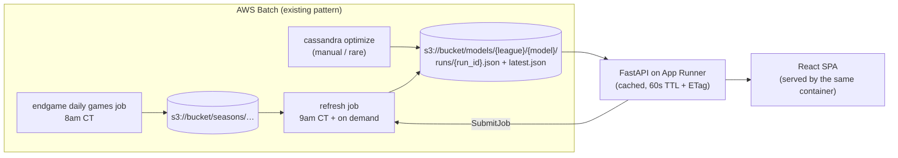

# invisible-string

A small webapp over [cassandra](https://github.com/NathanDeMaria/cassandra) model
results: current ratings per league, and win probability / predicted spread for a
hypothetical matchup.

```
infra/      terraform: ECR, App Runner service, Batch refresh job, IAM
backend/    FastAPI, depends on cassandra as a git dependency
frontend/   React + Redux Toolkit (RTK Query), built into backend's static dir
```

---

## 1. What cassandra gives us today

Worth being precise about this, because most of the design follows from the gaps.

**Ratings** live inside a predictor instance as a plain dict, with a shape that
varies by class:

| Predictor | rating shape | extra state |
|---|---|---|
| `EloPredictor` | `dict[str, float]` | `home_advantage`, `k` |
| `Elo538Predictor` | `dict[str, float]` | `home_advantage`, `k`, prior manager |
| `GlickoPredictor` | `dict[str, (rating, rd)]` | `home_advantage`, `k`, RD inflation params, `scoring_method`, prior manager |
| `FlatPredictor` | — (returns 0.5) | — |

`save_state(path)` writes that to local JSON; `load_state(path)` reads it back.
`evaluate_models.py` is the only thing that calls `save_state`, and it writes to
`~/.cassandra/models/<league>/<name>_result_state.json` — **on the machine that ran
the job**. Nothing about ratings currently reaches S3.

### 1a. Ratings don't move on `main` (fixed on a branch)

> Being addressed upstream already — recorded here only because the rest of this
> design assumes the fixed behavior, not because it's an open action item.

`generate_predictions` — the one loop every pipeline runs through — calls
`predictor.predict_game(game)`. Since commit `0f93c96` ("Split 'update' and
'predict'", March 2026), `predict_game` is the *pure* half: it reads ratings and
returns a probability without mutating anything. `update_game` is the half that
learns, and **nothing outside the unit tests calls it.**

That commit refactored all four predictors and all four test files, but didn't touch
`save_predictions.py`. So the caller kept calling what is now the read-only method.
The consequences, if this is what I think it is:

- `EloPredictor` starts with `ratings or {}` and every team stays at 1500 forever;
  its win probability is a constant determined only by `home_advantage`.
- `Glicko`/`Elo538` stay pinned at whatever `OpponentPriorManager` loaded, and
  `postrun_callback` then saves "final" priors computed from ratings that never moved.
- In `optimize.py`, `k` cannot affect the Brier objective at all, because nothing
  ever applies it. Only `home_advantage` does anything.

What this design takes from it: ratings are a genuine fold over the game sequence, so
a rating timeseries is meaningful and the incremental refresh in §5a is exact. Both
would be false against `main` as it stands today.

### 1b. Games are walked in fetch order, not chronological order (same branch)

`generate_predictions` iterates `season.weeks` and `week.games` directly. endgame's
own docstrings are pointed about this: *"Prefer this over `.weeks`: the raw list's
order depends on how the season happened to be built and merged, so it isn't
reliably chronological."*

NCAABB seasons carry `season_start = REGULAR_SEASON_START = (11, 1)`, and per the
`Season` docstring that means `.weeks` is *only a record of how the games were
fetched* — the chronological view is `calendar_weeks`, rebuilt from game dates,
precisely because source weeks "can still overlap in time." `iter_weeks()` exists to
walk this correctly and raises `OverlappingWeeksError` when they do overlap.

On `main`, `pass_week()` therefore fires on boundaries that may overlap in time, over
games in an arbitrary order. Everything below assumes the fixed form —
`iter_weeks(season)` and `week.games_in_order` — because a rating timeseries needs a
meaningful x-axis, and a fold is only reproducible if its sequence is deterministic.

**Predictions** are `predict_game(game: Game) -> Prediction(team1_win_prob)`. It
takes a whole `endgame.types.Game`, not two team names — deliberately, per the
comment in `base_predictor.py`. For a hypothetical matchup we have to synthesize a
`Game`, which is fine (Elo/Elo538/Glicko only read `home`, `away`, `neutral_site`
in `predict_game`) but shouldn't be re-invented by every caller.

**Spreads are not part of the predictor.** `evaluate_model` fits an
`IsotonicRegression` from win prob → market spread, uses it to compute
against-the-spread accuracy, and then **throws it away**. There is no persisted
prob→spread mapping anywhere. This is the single biggest gap for the matchup
feature.

**Everything is expensive.** `read_all_seasons` pulls 16 years of season pickles;
`OddsDatabase.from_s3` lists and reads *every* odds key in the bucket. This is
minutes of work and hundreds of MB. It must never happen inside a request.

**Sign conventions** (adopt these verbatim so nothing flips):
- `team1` == home. `team1_win_prob` is the home team's win probability.
- `spread` is the market handicap applied to home: `team1_covered = spread + (home_score - away_score) > 0`. So **negative spread = home favored**, and a
  predicted spread of `-6.5` renders as "Duke -6.5".

---

## 2. The core decision: a `ModelRelease` artifact in S3

The webapp never runs the model. A batch job produces a self-contained,
versioned JSON artifact; the API reads it, caches it, and serves everything from
it. This is the contract between cassandra and the webapp, and it's the only one.



Why an artifact rather than the API loading predictor state directly: it lets the
API stay ignorant of predictor internals, it makes "which model is live" an
explicit, revertible pointer, and it gives the refresh job an idempotency
watermark to work against.

### Schema

Defined as pydantic in cassandra (`cassandra/serving/release.py`), imported by the
backend — one definition, no drift.

```jsonc
{
  "schema_version": 1,
  "run_id": "2026-08-08T09:00:12Z",          // also the S3 object name
  "league": "mens",
  "model": "glicko_tuned",                    // config stem from optimize.py
  "predictor_class": "GlickoPredictor",

  // exactly what save_state() writes, minus ratings — enough to rebuild the
  // predictor for predict_game()
  "params": { "home_advantage": 95.0, "k": 65.0, "initial_rd": 216.0,
              "scoring_method": "binary", "weekly_rd_increase": 1.0,
              "season_rd_increase": 120.0 },

  "ratings": {
    "Duke": { "rating": 1834.2, "rd": 71.4, "wins": 24, "losses": 5 },
    "…":    { "rating": 1500.0, "rd": 216.0, "wins": 0, "losses": 0 }
  },

  // isotonic fit serialized as knots; np.interp at serve time, no sklearn,
  // no pickle-version fragility
  "spread_calibration": {
    "kind": "isotonic",
    "x_thresholds": [0.02, 0.05, ...],   // ascending win probs
    "y_thresholds": [21.5, 18.0, ...]    // descending spreads (increasing=False)
  },

  "metrics": { "brier_score": 0.1782, "against_spread_accuracy": 0.514,
               "n_games": 98342, "n_spread_games": 21150 },

  "trained_through": {
    "season_year": 2026,
    "last_game_date": "2026-08-07T23:15:00Z",
    "processed_game_ids": ["401710...", "..."]  // current season only
  },

  "created_at": "2026-08-08T09:00:12Z",
  "created_by": "refresh|optimize|post",
  "parent_run_id": "2026-08-07T09:00:08Z"      // null for a full retrain
}
```

Layout: `models/{league}/{model}/runs/{run_id}.json` plus
`models/{league}/{model}/latest.json` (a copy, not a pointer — one GET to serve).
Keeping every run means rollback is `aws s3 cp runs/<old>.json latest.json`.

`ratings` includes W-L because the refresh job already has the season in memory and
the API otherwise would have to read season pickles just to fill a table column.

---

## 3. Backend (`backend/`)

FastAPI, depends on cassandra as a git dep the same way cassandra depends on
endgame. Python 3.14 (cassandra pins `^3.14`).

```
backend/
  app/
    main.py            # app factory, static mount + SPA fallback
    api/
      ratings.py
      predict.py
      admin.py
    releases.py        # S3 fetch + in-process cache
    settings.py        # pydantic-settings: bucket, batch queue/def, admin token
  Dockerfile           # multi-stage: node build → python runtime
  pyproject.toml
```

### Endpoints

```
GET  /api/leagues
       -> [{league, models: [{name, is_default, run_id, created_at, metrics}]}]

GET  /api/leagues/{league}/ratings?model=&limit=&offset=
       -> {run_id, created_at, trained_through, metrics,
           ratings: [{rank, team, rating, rd?, wins, losses, delta_7d?}]}

GET  /api/leagues/{league}/history?model=&teams=Duke,UNC&from=&to=      # §6
       -> {series: [{team, points: [{year, week, date, rating, rd}]}]}

GET  /api/predict?league=&model=&home=&away=&neutral=false&home_advantage=
       -> {home, away, neutral, home_win_prob, away_win_prob,
           predicted_spread, home_rating, away_rating, run_id, model}

POST /api/admin/releases            (auth)  # push a run from a laptop
POST /api/admin/refresh             (auth)  -> {job_id}
GET  /api/admin/refresh/{job_id}    (auth)  -> {status, ...}

GET  /healthz   /readyz
```

`predict` is a **GET** on purpose: a matchup is a shareable, cacheable, linkable
thing, and RTK Query caches it for free. `home_advantage` is an optional override
for what-ifs — it's a constructor kwarg on every predictor, so it costs nothing to
support.

### How `predict` works

1. Fetch the cached `ModelRelease`.
2. `release.to_predictor()` — rebuilds e.g. `GlickoPredictor(league, **params, ratings=...)`.
3. `predictor.predict_game(synthetic_game(home, away, neutral))`, where the synthetic
   `Game` is `home_score=0, away_score=0, completed=False, date=now, game_id="synthetic"`.
   That helper belongs in cassandra, not here.
4. `predicted_spread = float(np.interp(p, x_thresholds, y_thresholds))`.
   (`np.interp` needs ascending `xp`, which `X_thresholds_` is; a decreasing `fp` is
   fine.) Clamp `p` into `[x[0], x[-1]]` so extreme mismatches don't extrapolate.

Rebuilding the predictor per request is microseconds — it's a dict assignment. Cache
the constructed predictor per `run_id` anyway.

### Caching

In-process, keyed by `(league, model)`, 60s TTL, refreshed with a conditional GET on
`latest.json`'s ETag. That makes multiple Fargate tasks converge within a minute of
any write without needing shared state, a cache-bust endpoint, or sticky routing.
Ratings change at most once a day.

### Auth

Single bearer token from Secrets Manager, checked by a FastAPI dependency on
`/api/admin/*`. Everything else is public read. If you'd rather not have a public
write path at all, drop `POST /api/admin/releases` — the jobs already write to S3
directly with their own role (see §5).

---

## 4. Frontend (`frontend/`)

Vite + React + TypeScript + Redux Toolkit. **All server data through RTK Query** —
the whole app is a server cache with two filters on top; hand-rolled thunks would be
pure overhead. Plain slices only for UI state.

```
frontend/src/
  app/store.ts
  services/api.ts          # RTK Query: getLeagues, getRatings, getPrediction
  features/ratings/        # RatingsTable, league picker, search
  features/matchup/        # team comboboxes, neutral toggle, ResultCard
  ui/                      # shared bits
```

Three routes:

- **`/ratings/:league`** — sortable table (rank, team, rating, RD, W-L, 7-day
  change). TanStack Table for sort/filter. ~360 D1 teams per league, so virtualize
  the rows but don't paginate — a scannable single list is the point. Row selection
  feeds the compare chart.
- **`/history/:league`** — rating-over-time lines for the selected teams, defaulting
  to the current season with a range picker back through 2010. Time on the x-axis,
  not week number (§6). Reachable from the ratings table with teams preselected, and
  team-keyed in the query string so a comparison is shareable.
- **`/matchup`** — two team comboboxes fed from the ratings response already in the
  RTK Query cache (no extra endpoint), a neutral-site toggle, and a result card:
  win probability for each side plus the spread rendered in familiar form
  ("Duke -6.5"). Mirror the form state into the query string so a matchup is a
  shareable link.

Header carries model + `trained_through` date, so it's always obvious how fresh the
numbers are.

Build output goes into the backend image and is served by FastAPI `StaticFiles` with
an SPA fallback — one container, one deploy, no CORS, no CloudFront. Worth splitting
later only if the frontend starts needing its own release cadence.

---

## 5. Update paths

Three ways a new release appears, all producing the same artifact.

### a. Nightly refresh (the "live update" feature)

EventBridge Scheduler → Batch, 9am CT, after endgame's 8am games job.

1. Read `latest.json` for each `(league, model)`.
2. Rehydrate the predictor from `ratings` + `params`.
3. Read **only the current season** from S3 (`seasons/{year}/{gender}.pkl`) — not all 16.
4. Take completed games whose `game_id` is not in `processed_game_ids`, walk them in
   `iter_weeks` / `games_in_order` order, calling `update_game`, with `pass_week()` at
   week boundaries.
5. Recompute W-L, write a new run, flip `latest.json`.

**This is exact, not an approximation.** Elo, Elo538 and Glicko updates are a pure
fold over the game sequence, and Glicko's RD inflation is per-week/per-season — so
incrementally applying today's games to yesterday's state gives bit-for-bit what a
full replay would, *provided* the games go in the same order and week boundaries are
honored. Two things to be careful about:

- **Never call `postrun_callback()` in this job.** It calls
  `OpponentPriorManager.save`, which raises if the priors file already exists, and
  those priors are a full-history artifact that a daily job has no business rewriting.
  `update_game` also calls `_prior_manager.add_game`, but that's in-memory counting
  only — harmless.
- **`processed_game_ids`, not a timestamp watermark.** Games get re-fetched and
  scores corrected; endgame's own `calendar_weeks` de-dupes by `game_id` for exactly
  this reason. An id set makes the job idempotent and safe to re-run.

Guardrail: a weekly full replay that diffs against the incremental ratings and alerts
on divergence beyond a threshold. Cheap, and it catches an ordering bug before it
compounds over a season.

### b. Admin-triggered refresh

`POST /api/admin/refresh` calls `batch:SubmitJob` on the same job definition and
returns the job id; `GET /api/admin/refresh/{job_id}` polls `DescribeJobs`. The API
stays small, no long work in the web task, and it reuses infra that already exists.

### c. Posting a new model run

After `optimize.py` / `evaluate_models.py`, you have a fresh model. **Preferred: the
job writes the release to S3 itself** — it already holds S3 credentials via the Batch
job role, and then there is exactly one write path and no "which source wins"
question. `POST /api/admin/releases` is a thin authenticated wrapper doing the same
write, for pushing a run from a laptop that isn't running in Batch. Both validate
against the same pydantic model. A posted run always starts a fresh lineage
(`parent_run_id: null`), and the next nightly refresh continues from it.

---

## 6. Rating history per team

The predictor callbacks are the right seam for this — `pass_week()` is already
invoked at exactly the granularity a chart wants, on every pipeline run, for free.
Two changes make it usable.

### The `ratings` accessor

`Predictor` has no way to read ratings out. `get_rating` is defined per subclass with
incompatible return types (`float` for Elo/Elo538, `_Rating` for Glicko) and doesn't
exist at all on `FlatPredictor`. So the base class needs a normalized view:

```python
class TeamRating(NamedTuple):
    rating: float
    rd: float | None = None

class Predictor(ABC):
    @property
    def ratings(self) -> dict[str, TeamRating] | None:
        """None for predictors that don't rate teams."""
        return None
```

`None` doubles as the capability flag from §9.8 — it's what tells the ratings table
and the history job to skip `FlatPredictor`.

### An observer, not an overridden callback

The tempting move is a wrapper `Predictor` that overrides `pass_week()` to snapshot.
I'd avoid it: `pass_week` is part of the *model's* contract — it's where Glicko
inflates RD — so a snapshot taken inside it is ambiguous about whether it lands
before or after that inflation, and a wrapper has to reimplement the whole ABC to
delegate. Instead, hang an optional observer off the traversal, where the call site
controls ordering:

```python
def generate_predictions(
    predictor, seasons, post_callbacks=False, week_observer=None
) -> Iterator[GameResult]:
    for season in seasons:
        for week in iter_weeks(season):              # §1b
            for game in week.games_in_order:
                prediction = predictor.update_game(game)   # §1a
                yield GameResult(prediction, game, season.year, week.number)
            if week_observer:
                week_observer(season.year, week.number, predictor.ratings)
            predictor.pass_week()
        predictor.pass_season()
```

Snapshotting *before* `pass_week`/`pass_season` means each point is "the rating this
team finished that week with," which is what you want to plot. `pass_season()` is
then the natural place to capture end-of-season finals — worth keeping deliberate,
since Glicko's big RD reset happens there, so a post-`pass_season` reading is next
season's *starting* state, not this season's result.

### Storage

Long format, one file per `(league, model)`:
`models/{league}/{model}/history.parquet` with columns
`team, year, week, rating, rd, run_id`.

Sizing: ~360 teams × ~20 weeks × 16 seasons ≈ 115k rows per model. That's a couple of
MB as Parquet — small enough that the API loads the whole thing once and caches it
alongside the release, and small enough that per-team files (360 S3 puts, N requests
to compare three teams) aren't worth it.

The two producers split cleanly along the same line as §5:

- **Full replay** (retrain, or the weekly guardrail) rewrites `history.parquet` end
  to end — it's the only thing that *can*, since it's the only thing that walks all
  16 seasons.
- **Daily refresh** upserts the current `(team, year, week)` rows. Upsert rather than
  append because ratings move within a week as games land, and the job must stay
  idempotent.

This also subsumes the `delta_7d` column in the ratings table — with history on hand
it's a lookup, not a diff against yesterday's release, so releases don't need to be
retained just to compute it.

### Serving it

```
GET /api/leagues/{league}/history?model=&teams=Duke,UNC&from=2025&to=2026
    -> {series: [{team, points: [{year, week, date, rating, rd}]}]}
```

Team-filtered, because the useful view is 2–5 teams overlaid, not 360. On the
frontend it's a line chart on the team detail route plus a "compare" affordance from
the ratings table (select rows → chart them). Include a real `date` per week
alongside `(year, week)` so the x-axis is time rather than an integer that resets
every November.

## 7. Infra (`infra/`)

Follows the endgame `jobs/` conventions: `us-east-2`, S3 backend in the
`nathan-terraform` bucket (key `invisible-string/terraform.tfstate`), a `Makefile`
with `plan`/`apply`, `scheduled_job`-style module for the Batch piece.

### App Runner instead of Fargate + ALB

**What it is:** point it at a container image in ECR and it runs it — no ECS cluster,
no task definition, no load balancer, no target groups, no VPC. It hands back an
HTTPS URL on a managed certificate, autoscales on concurrent requests, and does
rolling deploys when the image tag moves. Effectively "Fargate with the networking
already solved."

What it replaces from the previous sketch: the ALB, the ACM cert, the target group,
the listener rules, the ECS cluster and service, the security groups, and the subnet
wiring. That's most of the terraform.

The mapping from the Fargate concepts is close to one-to-one:

| Fargate + ALB | App Runner |
|---|---|
| task role | `instance_role_arn` — same thing, same IAM policies |
| execution role (ECR pull) | `access_role_arn` on the image repository config |
| ALB + ACM + Route53 alias | `aws_apprunner_custom_domain_association` (managed cert, you add the DNS validation records) |
| target group health check | `health_check_configuration` → `/healthz` |
| desired count / autoscaling | `aws_apprunner_auto_scaling_configuration_version` |

**The reason it's actually a better fit, not just cheaper:** §3's caching design
assumes a long-lived process holding the release JSON and `history.parquet` in
memory. App Runner keeps a warm container, so that holds. This is also why I'd steer
away from the Lambda + Mangum option I mentioned earlier — per-invocation cold starts
would mean re-reading multi-MB artifacts from S3 constantly, and the whole caching
story would have to be rebuilt around something external.

**Cost:** roughly $5–10/mo at 1 vCPU / 2 GB, billed as a low idle rate on provisioned
memory plus compute only while serving requests. Versus ~$16/mo for the ALB alone
before any compute. One caveat worth knowing up front: App Runner's minimum is 1
instance — there's no automatic scale-to-zero, only a manual "pause". So the floor is
a few dollars a month, not zero.

**Things to know before committing:**
- One HTTP port, which is exactly what the single-container design in §4 produces.
- Default egress is the public internet, which is fine — S3 and Batch are public
  endpoints. A VPC connector is only needed for private resources, and there are none
  here.
- Custom domain validation is a CNAME dance; terraform exposes the records to create,
  but the association can take a few minutes to go active on first apply.

### The rest

- ECR repo for the app image.
- App Runner service + autoscaling config + custom domain association.
- Instance role: `s3:GetObject`/`ListBucket` on `models/*` in the endgame bucket,
  `s3:PutObject` on the same prefix (only if keeping the POST endpoint),
  `batch:SubmitJob` + `batch:DescribeJobs`, `secretsmanager:GetSecretValue` for the
  admin token.
- Batch job definition + EventBridge Scheduler rule for the refresh job, reusing the
  existing job queue. Unchanged by the App Runner switch — the refresh job was never
  going to run in the web container.
- Reuse endgame's SNS failure topic pattern for refresh-job alerts.

---

## 8. CI/CD

### What already exists to match

`EndGame/.github/workflows/on_push.yml` is the house style: a `lint` job matrixed
over packages (`poetry install`, `ruff format --check`, `ruff check`, `ty check`),
then a `make-push` job gated on it that builds and pushes the image to ECR. CI calls
**Makefile targets**, not inlined shell, so local and CI run the same thing — worth
continuing. cassandra has a `Makefile` with `lint`/`test` but no workflows at all.

Two things not to inherit:

- **EndGame's lint job never runs the tests**, despite `*_test.py` files throughout.
  Add pytest here from the start.
- **cassandra's `make lint` runs `ruff check --fix`**, which mutates the tree. Fine
  locally, wrong in CI — it can "pass" by rewriting code nobody reviewed. Split
  `make fmt` (mutating, local) from `make lint` (check-only, CI).

Type checking is **`ty`**, matching EndGame. (cassandra still uses mypy — that
divergence is worth closing in whichever direction, see §11.5.) My earlier pitch for
mypy leaned on the pydantic plugin, which overstated things: pydantic v2 implements
PEP 681 `@dataclass_transform`, so model `__init__` signatures are inferred natively
by any conforming checker and the plugin isn't load-bearing the way it was under v1.
`ty` being pre-1.0 (`^0.0.65`) is the real cost, and it's a pinned dev dependency in
a repo you own — cheap to hold back if a release regresses.

Python pins to 3.14, since that's what cassandra requires. Note EndGame's workflow
uses 3.12, so this is not a copy-paste of its `setup-python` step.

### Three stacks, one gate

The three directories have independent toolchains and change independently, so
running all of them on every commit is waste — but naive `paths:` filters plus
branch protection is the classic footgun: a required check that's skipped never
reports, and the PR blocks forever.

The pattern that actually works:

```yaml
jobs:
  changes:              # always runs, dorny/paths-filter
    outputs: {backend, frontend, infra}
  backend:   if: needs.changes.outputs.backend == 'true'
  frontend:  if: needs.changes.outputs.frontend == 'true'
  infra:     if: needs.changes.outputs.infra == 'true'
  ci:        # always runs, needs: [backend, frontend, infra]
             # fails if any dependency failed; passes if they were skipped
```

`ci` is the **only** required status check. Everything else is free to skip.

| Workflow | Trigger | Does |
|---|---|---|
| `ci.yml` | push, PR | the above — lint + test per changed stack |
| `image.yml` | push to `main` (backend/frontend paths) | build + push to ECR |
| `terraform.yml` | `infra/**` on any branch or PR → plan; push to `main` → apply | |

### Per-stack checks

**`backend/`** — `ruff format --check`, `ruff check`, `ty check`, `pytest`.

The `ModelRelease` artifact pays off here: tests need a small fixture JSON and
nothing else — no S3, no model run, no 16 seasons of pickles. Override the release-store
dependency with a fake via FastAPI's `dependency_overrides` rather than
reaching for `moto`; it's a one-function seam.

Worth one dedicated test: **validate the golden fixture against cassandra's current
`ModelRelease` schema.** cassandra is pinned by git rev, so drift only happens when
you bump the pin — and this is what tells you the bump broke something, rather than
finding out from a 500 in production.

**`frontend/`** — `eslint`, `prettier --check`, `tsc --noEmit`, `vitest`.

Plus one check that earns its keep with RTK Query: **generate the API client from
FastAPI's OpenAPI schema and fail if the committed types are stale.** Run the
backend's schema export, regenerate with `@rtk-query/codegen-openapi`, `git diff
--exit-code`. Without it, a renamed response field is a runtime `undefined` in the
browser that nothing catches. This is the highest-value check in the whole setup,
because it's the one seam where the two stacks can silently disagree.

**`infra/`** — `terraform fmt -check -recursive`, `terraform init -backend=false`,
`terraform validate`. Add `tflint` if it starts feeling loose; skip `checkov` for
something this small.

### Credentials: OIDC, two roles

**Decided:** no long-lived keys. EndGame's `AWS_ACCESS_KEY_ID` /
`AWS_SECRET_ACCESS_KEY` repo secrets don't come along — terraform apply needs
near-admin permissions, and a static key with those rights in repo secrets is the
worst artifact in the design.

`aws-actions/configure-aws-credentials` with `role-to-assume`, and
`permissions: { id-token: write, contents: read }` on the job.

| Role | Assumed by | Permissions |
|---|---|---|
| `invisible-string-ci-plan` | any branch push, any PR | read-only AWS + read/write terraform state (plan needs the lock) |
| `invisible-string-ci-apply` | pushes to `main` only | terraform apply + ECR push |

The separation only means something if the trust policies are right, and the `sub`
claim formats are easy to get wrong — they differ per event type:

```jsonc
// plan role — branch pushes and PRs from this repo
"StringLike": {
  "token.actions.githubusercontent.com:sub": [
    "repo:NathanDeMaria/invisible-string:ref:refs/heads/*",
    "repo:NathanDeMaria/invisible-string:pull_request"
  ]
}

// apply role — main only, exact match, no wildcard
"StringEquals": {
  "token.actions.githubusercontent.com:sub":
    "repo:NathanDeMaria/invisible-string:ref:refs/heads/main",
  "token.actions.githubusercontent.com:aud": "sts.amazonaws.com"
}
```

Note the PR case is `:pull_request`, **not** a `refs/heads/` ref — a plan role
trusting only `ref:refs/heads/*` silently fails on every PR. And the apply role uses
`StringEquals`, because `StringLike` with a stray `*` is how `refs/heads/main-hotfix`
ends up with apply rights.

Two supporting rules:
- Trigger on `pull_request`, never `pull_request_target`. The latter runs the *base*
  workflow with secrets exposed to a fork's code.
- `terraform plan` executes provider code, so treating plan credentials as
  untrusted-input-adjacent is the whole point of splitting the roles.

Bootstrapping is circular — the OIDC provider and both roles are themselves terraform
in `infra/`. Apply once from your laptop, and thereafter it manages itself.

### Deploying the app

App Runner changes the shape here for the better. Rather than terraform running on
every app change:

1. `image.yml` builds the multi-stage image (node build → python runtime, per §4) and
   pushes `:${GITHUB_SHA::7}` plus `:latest`, only from `main`.
2. The App Runner service has `auto_deployments_enabled = true` watching `:latest`,
   so the push *is* the deploy. No `apprunner start-deployment`, no terraform.

That keeps "ship the app" (frequent, fast) fully separate from "change the infra"
(rare, reviewed). Rollback is retagging a known-good SHA as `:latest`.

Reuse EndGame's buildx **registry** layer cache (`type=registry` against a
`:buildcache` tag) rather than `type=gha` — the comment in `on_push.yml` explains why
at length, and the reasoning carries over unchanged.

### Terraform apply

**Decided: plan on every branch, apply on `main`**, plus `workflow_dispatch` as a
manual escape hatch. Matches EndGame's `branches: ["*"]` trigger style.

Planning on branch pushes rather than only on PRs means a plan often has no PR to
comment on. So write the plan to **`$GITHUB_STEP_SUMMARY`** unconditionally — it
renders on the run page either way — and post the sticky PR comment only when
`github.event_name == 'pull_request'`. One code path for the plan itself, comment as
an add-on, no branch-vs-PR special-casing in the terraform step.

Wrap the plan body in `<details>` and truncate past ~60KB; GitHub silently drops
step summaries over 1MB and comments over 65KB, and a first apply that creates the
App Runner service plus IAM will produce a large plan.

State is already S3 with `use_lockfile = true`, so native S3 locking handles
concurrency — no DynamoDB table. Add
`concurrency: { group: terraform-apply, cancel-in-progress: false }` so two merges
can't apply simultaneously, and note this is deliberately *not* `cancel-in-progress`:
killing terraform mid-apply is how you get a stale lock and a half-built service.
Plan jobs can cancel freely (`group: terraform-plan-${{ github.ref }}`).

One tradeoff left open: re-planning at apply time (simpler) versus uploading the
branch's plan file as an artifact and applying exactly that (correct — what you
reviewed is what runs). Re-plan is fine while you're the only one merging; if an
apply ever surprises you, that's the knob.

### Keeping up with cassandra

The git-rev pin means bumping cassandra is a manual `poetry lock` and Dependabot
won't do it. Given how tightly coupled the two are, a weekly scheduled workflow that
bumps the rev to cassandra's `main`, runs the schema contract test, and opens a PR
is a small amount of YAML that turns "the artifact schema changed under me" from a
production surprise into a red check.

---

## 9. Changes needed in cassandra

The webapp shouldn't reimplement any model math, which means a handful of additions
upstream. Items 1 and 3 (the §1a/§1b correctness fixes) are already in flight on a
branch and are listed only to mark the dependency; the rest are new work, ordered by
dependency.

1. ~~Call `update_game`, not `predict_game`, in `generate_predictions` (§1a).~~
   *In flight.*
2. **Persist the prob→spread calibration.** `BaseProbToSpreadPredictor` gets
   `to_dict()` / `from_dict()`; `IsotonicProbToSpreadPredictor` serializes
   `X_thresholds_` / `y_thresholds_`. `evaluate_model` currently fits and discards
   the calibrator — return it instead. **Blocking for the matchup feature.**
3. ~~Walk seasons chronologically with `iter_weeks` / `games_in_order` (§1b).~~
   *In flight.*
4. **A normalized `Predictor.ratings` property (§6)** returning
   `dict[str, TeamRating] | None`. Feeds the release artifact, the history job, and
   the "does this model rate teams" check that keeps `FlatPredictor` out of the
   ratings table.
5. **A `week_observer` hook on `generate_predictions` (§6)** so history capture
   doesn't have to subclass or wrap a predictor.
6. **`cassandra/serving/`**: the `ModelRelease` pydantic model, `to_predictor()`,
   S3 read/write helpers, and a `predict_matchup(predictor, home, away, neutral_site)`
   that builds the synthetic `Game` in one place.
7. **State as a dict, not a path.** `save_state`/`load_state` are file-based; add
   `state_dict()` / `from_state_dict()` and let the file versions delegate. Avoids
   round-tripping through a temp file in a request handler.
8. **Make `postrun_callback` re-runnable.** `OpponentPriorManager.save` raising when
   priors exist means any second run with `post_callbacks=True` crashes. Either
   overwrite behind an explicit flag, or version the priors file.
9. **`read_all_seasons` hard-codes `range(2010, 2026)`** — it silently stops picking
   up seasons in 2026. Its own TODO. The refresh job reads the current season
   directly and doesn't hit this, but the optimizer does.
10. **`league` shouldn't be `NcaabbGender`.** `optimize.py` does
    `NcaabbGender[config.league]`, which locks everything to mens/womens even though
    endgame also has nfl and ncaafb. The API treats league as an opaque string; a
    small registry upstream would let the webapp pick up football for free.
11. **Bug, unrelated but noticed:** `_serialize_predictions` writes a 7-column header
    for a 9-field dataclass and does `",".join(asdict(result).values())` on a dict of
    ints/floats/bools, which raises `TypeError`. `main.py` is the only caller.

Items 1, 3 and 8 change model *output*, not just plumbing — any parameters tuned
before them were fit against a model that wasn't learning. Re-optimizing once they
land is what makes the numbers on screen ones worth showing; it isn't work this repo
needs to do, just something the release artifacts should be produced after.

---

## 10. Phasing

| Phase | Scope |
|---|---|
| 1 | cassandra plumbing: calibration persistence, `Predictor.ratings`, `week_observer`, `serving/`, state dicts. One release JSON + `history.parquet` in S3, written by hand from a local run. |
| 2 | `backend/`: ratings, predict and history endpoints reading those files. Run locally. `ci.yml` with the change-detection gate lands here — cheap now, annoying to retrofit. |
| 3 | `frontend/`: ratings table, matchup page, rating chart. Still local. Add the OpenAPI codegen drift check with the first typed endpoint. |
| 4 | `infra/`: OIDC roles first (bootstrapped by hand), then ECR, App Runner, DNS. `image.yml` + `terraform.yml`. Ship it. |
| 5 | Refresh job + scheduler + admin endpoints. This is where the "live update" lands. |
| 6 | Nice-to-haves: weekly full-replay guardrail, upcoming games with predictions attached. |

Phases 2–4 need nothing from phase 5, so the app is useful — just manually refreshed
— from phase 4 on. Phase 1 depends on the §1a/§1b fixes landing, but only to produce
*trustworthy* artifacts; the plumbing itself can be built against either.

---

## 11. Open questions

1. **Which model is "the" model per league?** The ratings table needs a default.
   Simplest is a `default_model` field in the release index (or just "highest
   against-spread accuracy"), but it should be an explicit choice you control, not
   inferred.
2. **Same bucket as endgame, or a separate one?** Sharing means one IAM policy and
   no cross-account anything; separating keeps model outputs from raw data. I'd share
   it under a `models/` prefix unless you want a different lifecycle policy.
3. **How far back should history go?** §6 assumes all 16 seasons, which is only a
   couple of MB — but it means every full replay rewrites the whole file, and it
   makes the chart's default view a question (all-time is unreadable; current season
   is probably the right default with a range picker).
4. **Public or private?** Everything above assumes public reads and an
   authenticated admin path. App Runner has no ALB to hang an IP allowlist off, so
   if the whole app should be private that's either real auth in the app or a
   different hosting shape — worth deciding before phase 4.
5. **Backfill CI onto cassandra, and move it to `ty`?** It has `make lint`/`make
   test` and no workflows, and this repo is about to depend on it by git rev for a
   schema contract — a green cassandra `main` should mean something when you bump the
   pin. Doing that is also the moment to drop its mypy/`ty` divergence with the other
   two repos, though its `ruff.lint.select = ["I"]` (isort only, versus EndGame's
   `["E","F","I"]`) will surface real findings on first run.
