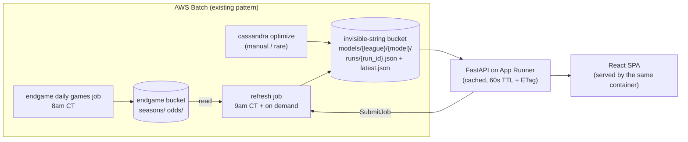

# invisible-string

A small webapp over [cassandra](https://github.com/NathanDeMaria/cassandra) model
results: current ratings per league, win probability / predicted spread for a
hypothetical matchup, and the games around today with the best model's number
beside the book's.

```
infra/      terraform: ECR, App Runner service, Batch refresh job, IAM
backend/    FastAPI, depends on cassandra as a git dependency
frontend/   React + Redux Toolkit (RTK Query), built into backend's static dir
```

---

## 1. What cassandra gives us today

Worth being precise about this, because most of the design follows from the gaps.

**Ratings** live inside a predictor instance as a plain dict, with a shape that
varies by class:

| Predictor | rating shape | extra state |
|---|---|---|
| `EloPredictor` | `dict[str, float]` | `home_advantage`, `k` |
| `Elo538Predictor` | `dict[str, float]` | `home_advantage`, `k`, prior manager |
| `GlickoPredictor` | `dict[str, (rating, rd)]` | `home_advantage`, `k`, RD inflation params, `scoring_method`, prior manager |
| `FlatPredictor` | — (returns 0.5) | — |

`save_state(path)` writes that to local JSON; `load_state(path)` reads it back.
`evaluate_models.py` is the only thing that calls `save_state`, and it writes to
`~/.cassandra/models/<league>/<name>_result_state.json` — **on the machine that ran
the job**. Nothing about ratings currently reaches S3.

### 1a. Ratings didn't move on `main` — fixed (§9.1)

> **Resolved upstream.** Kept because it explains why the rest of this document
> assumes ratings are a real fold, and why any parameters tuned before the fix
> are worth re-optimizing.

`generate_predictions` — the one loop every pipeline runs through — called
`predictor.predict_game(game)`. Since commit `0f93c96` ("Split 'update' and
'predict'", March 2026), `predict_game` is the *pure* half: it reads ratings and
returns a probability without mutating anything. `update_game` is the half that
learns, and **nothing outside the unit tests called it.**

That commit refactored all four predictors and all four test files, but didn't touch
`save_predictions.py`. So the caller kept calling what had become the read-only
method. The consequences, while it lasted:

- `EloPredictor` started with `ratings or {}` and every team stayed at 1500 forever;
  its win probability was a constant determined only by `home_advantage`.
- `Glicko`/`Elo538` stayed pinned at whatever `OpponentPriorManager` loaded, and
  `postrun_callback` then saved "final" priors computed from ratings that never moved.
- In `optimize.py`, `k` could not affect the Brier objective at all, because nothing
  ever applied it. Only `home_advantage` did anything.

What this design takes from it: ratings are a genuine fold over the game sequence, so
a rating timeseries is meaningful and the incremental refresh in §5a is exact. Both
are true now, and neither was before the fix — which is why the artifacts worth
publishing are the ones produced after it.

### 1b. Games were walked in fetch order, not chronological order — fixed (§9.3)

`generate_predictions` iterated `season.weeks` and `week.games` directly. endgame's
own docstrings are pointed about this: *"Prefer this over `.weeks`: the raw list's
order depends on how the season happened to be built and merged, so it isn't
reliably chronological."*

NCAABB seasons carry `season_start = REGULAR_SEASON_START = (11, 1)`, and per the
`Season` docstring that means `.weeks` is *only a record of how the games were
fetched* — the chronological view is `calendar_weeks`, rebuilt from game dates,
precisely because source weeks "can still overlap in time." `iter_weeks()` exists to
walk this correctly and raises `OverlappingWeeksError` when they do overlap.

So `pass_week()` fired on boundaries that could overlap in time, over games in an
arbitrary order. `generate_predictions` now sorts seasons by year and walks
`iter_weeks(season)` / `week.games_in_order`, which is what everything below
assumes — a rating timeseries needs a meaningful x-axis, and a fold is only
reproducible if its sequence is deterministic.

**Predictions** are `predict_game(matchup: Matchup) -> Prediction(team1_win_prob)`.
`Matchup` is a Protocol — the pre-game half of a game (`home`, `away`,
`neutral_site`, `date`, `game_id`) — which `Game` satisfies structurally. So a
hypothetical matchup needs no synthetic `Game` with fake scores, and an
implementation taking a `Matchup` can't peek at the results. `update_game` is the
half that takes a whole `Game` and learns from it.

**Margins are not part of the predictor.** They're a separate fit, and one that
changed shape after this document was first written. Historically `evaluate_model`
fit an `IsotonicRegression` from win prob → **market spread** with
`increasing=False`, used it for against-the-spread accuracy, and then threw it
away — no persisted mapping anywhere, which was the single biggest gap for the
matchup feature.

Since cassandra's `e80ef85` it fits win prob → **margin of victory**,
`increasing=True`, and persists it (§9.2). Two consequences worth stating plainly:

- **It trains on every game with a final score**, not the ~20% a book hung a line
  on. That's five times the data, and it stops the calibration inheriting the
  market's coverage bias — books price the games people bet on.
- **The sign flipped.** Both threshold lists now ascend, and a higher win
  probability means a *more positive* number: the home team wins by more. The
  display convention below did not change; the API just negates at the boundary.

**Everything is expensive.** `read_all_seasons` pulls 16 years of season pickles;
`OddsDatabase.from_s3` lists and reads *every* odds key in the bucket. This is
minutes of work and hundreds of MB. It must never happen inside a request.

**Sign conventions** (adopt these verbatim so nothing flips):
- `team1` == home. `team1_win_prob` is the home team's win probability.
- `spread` is the market handicap applied to home: `team1_covered = spread + (home_score - away_score) > 0`. So **negative spread = home favored**, and a
  predicted spread of `-6.5` renders as "Duke -6.5".
- `margin` is the plain difference, `home_score - away_score`, so **positive
  margin = home won**. It is the negation of the spread, which is why the one
  line in §3 that converts between them is worth reading twice.

---

## 2. The core decision: a `ModelRelease` artifact in S3

The webapp never runs the model. A batch job produces a self-contained,
versioned JSON artifact; the API reads it, caches it, and serves everything from
it. This is the contract between cassandra and the webapp, and it's the only one.



Why an artifact rather than the API loading predictor state directly: it lets the
API stay ignorant of predictor internals, it makes "which model is live" an
explicit, revertible pointer, and it gives the refresh job an idempotency
watermark to work against.

### Schema

Defined as pydantic in cassandra (`cassandra/serving/release.py`), imported by the
backend — one definition, no drift.

```jsonc
{
  "schema_version": 1,
  "run_id": "2026-08-08T09:00:12Z",          // also the S3 object name
  "league": "mens",
  "model": "glicko_tuned",                    // config stem from optimize.py
  "predictor_class": "GlickoPredictor",

  // exactly what save_state() writes, minus ratings — enough to rebuild the
  // predictor for predict_game()
  "params": { "home_advantage": 95.0, "k": 65.0, "initial_rd": 216.0,
              "scoring_method": "binary", "weekly_rd_increase": 1.0,
              "season_rd_increase": 120.0 },

  "ratings": {
    "Duke": { "rating": 1834.2, "rd": 71.4, "wins": 24, "losses": 5 },
    "…":    { "rating": 1500.0, "rd": 216.0, "wins": 0, "losses": 0 }
  },

  // win prob -> margin of victory. A union discriminated on `kind`, because
  // cassandra's DEFAULT_FITTERS scores more than one and stores the winner.
  // Serialized as parameters, never as a pickled estimator: serving needs
  // np.interp and nothing else, and a scikit-learn upgrade can't make old
  // releases unreadable.
  "margin_calibration": {
    "kind": "isotonic",
    "x_thresholds": [0.0803, 0.0867, ...],  // ascending win probs
    "y_thresholds": [-14.69, -14.69, ...]   // ascending margins (increasing=True)
  },
  // or: { "kind": "logistic", "scale": 11.83 } — isotonic flattens outside the
  // win probs the season contained; logistic keeps extrapolating, which is the
  // lopsided-matchup case §3 clamps for.

  "metrics": { "brier_score": 0.1782, "margin_mae": 9.4,
               "against_spread_accuracy": 0.514,
               "spread_game_margin_mae": 9.1, "market_margin_mae": 8.8,
               "n_games": 98342, "n_spread_games": 21150 },

  "trained_through": {
    "season_year": 2026,
    "last_game_date": "2026-08-07T23:15:00Z",
    "processed_game_ids": ["401710...", "..."]  // current season only
  },

  "created_at": "2026-08-08T09:00:12Z",
  "created_by": "refresh|optimize|post",
  "parent_run_id": "2026-08-07T09:00:08Z"      // null for a full retrain
}
```

### Reading the metrics

`brier_score` stays the selection rule (§11.1) — it's over every game and it's what
the optimizer targets. The three MAEs are margin errors in points, and two of them
are only meaningful as a pair:

| Field | Over | Says |
|---|---|---|
| `margin_mae` | every game with a final score | how far off the margin fit is, on its own terms. Not comparable across leagues, and not comparable to anything else. |
| `spread_game_margin_mae` | just the games a book priced | the model's error on that subset |
| `market_margin_mae` | the same subset | the closing line's error on it |

The signal is the **gap** between the last two. `margin_mae` alone means very little
— it's measured on a different, larger population than the market number, so
comparing them directly flatters the model on exactly the games nobody was willing
to price. The bottom two are None for a league with no odds coverage, because
cassandra maps nan to null on the way out: `json.dumps` writes nan as a bare `NaN`
token that isn't valid JSON and that `JSON.parse` rejects.

Layout, in this repo's own bucket (§11.2): `models/{league}/{model}/runs/{run_id}.json`
plus `models/{league}/{model}/latest.json` (a copy, not a pointer — one GET to serve).
Keeping every run means rollback is `aws s3 cp runs/<old>.json latest.json`.

Discovering which models exist for a league is a `ListObjectsV2` on
`models/{league}/` delimited at `/`, then one GET per `latest.json`. At a handful of
models per league that's fine behind the §3 cache, and it's why the instance role
needs `ListBucket` and not just `GetObject`.

`ratings` includes W-L because the refresh job already has the season in memory and
the API otherwise would have to read season pickles just to fill a table column.

---

## 3. Backend (`backend/`)

FastAPI, depends on cassandra as a git dep the same way cassandra depends on
endgame. Python 3.14 (cassandra pins `^3.14`).

```
backend/
  app/
    main.py            # app factory, static mount + SPA fallback
    api/
      ratings.py
      predict.py
      admin.py
    releases.py        # S3 fetch + in-process cache
    settings.py        # pydantic-settings: bucket, batch queue/def, admin token
  Dockerfile           # multi-stage: node build → python runtime
  pyproject.toml
```

### Endpoints

```
GET  /api/leagues
       -> [{league, models: [{name, is_default, run_id, created_at, metrics}]}]
       # is_default = lowest metrics.brier_score for the league (§11.1)

GET  /api/leagues/{league}/ratings?model=&limit=&offset=
       -> {run_id, created_at, trained_through, metrics,
           ratings: [{rank, team, rating, rd?, wins, losses, delta_7d?}]}

GET  /api/leagues/{league}/history?model=&teams=Duke,UNC&from=&to=      # §6
       -> {series: [{team, points: [{year, week, date, rating, rd}]}]}

GET  /api/predict?league=&model=&home=&away=&neutral=false&home_advantage=
       -> {home, away, neutral, home_win_prob, away_win_prob,
           predicted_spread, home_rating, away_rating, run_id, model}

GET  /api/games?back=2&ahead=1                                         # §13
       -> {days_back, days_ahead, since, until,
           games: [{league, game_id, start, day, home, away, neutral,
                    completed, home_score, away_score, market_spread,
                    prediction: {...} | null}]}

POST /api/admin/releases            (auth)  # push a run from a laptop
POST /api/admin/refresh             (auth)  -> {job_id}
GET  /api/admin/refresh/{job_id}    (auth)  -> {status, ...}

GET  /healthz   /readyz
```

`predict` is a **GET** on purpose: a matchup is a shareable, cacheable, linkable
thing, and RTK Query caches it for free. `home_advantage` is an optional override
for what-ifs — it's a constructor kwarg on every predictor, so it costs nothing to
support.

### How `predict` works

1. Fetch the cached `ModelRelease`.
2. `release.to_predictor()` — rebuilds e.g. `GlickoPredictor(league, **params, ratings=...)`.
3. `predictor.predict_game(matchup)`. This got simpler than originally written:
   `predict_game` now takes a `Matchup` — a Protocol in
   `cassandra/predictor/types.py` covering "the part of a game that's known before
   it's played" (`home`, `away`, `neutral_site`, `date`, `game_id`). `Game`
   satisfies it structurally, so no synthetic `Game` with fake scores is needed, and
   an implementation taking a `Matchup` *cannot* reach the results even by accident.
4. **Negate at the boundary.** The calibration predicts margin; the wire format is
   the market's spread.

   ```python
   predictor = release.margin_predictor()   # None if the release carries no fit
   margin = float(predictor.predict_margins(np.array([p]))[0])
   predicted_spread = -margin               # renders as "Duke -6.5"
   ```

   `margin_predictor()` rehydrates whichever fitter won — `np.interp` over the
   knots for the isotonic one, `scale * logit(p)` for the logistic one. It
   returns `None` when `margin_calibration` is null, which is a real case: a
   release written before the fit existed, or a predictor flat enough that there
   was no slope to fit. `/api/predict` should answer with the win probability and
   omit the spread rather than 500.

   Don't reimplement the evaluation here. Storing the fit as parameters is what
   lets reading it work without scikit-learn — it isn't an invitation for every
   caller to reinvent `np.interp`. The isotonic predictor also clamps outside the
   fitted range, where `IsotonicRegression` itself returns `nan`; a season only
   spans roughly `[0.05, 0.95]`, so a lopsided matchup lands outside it and the
   nan would surface as a blank number a long way from here.

   This image genuinely cannot fit, by construction: cassandra keeps
   scikit-learn in a poetry `fit` group, and poetry groups aren't part of package
   metadata, so the git dependency doesn't pull it in and
   `IsotonicProbToMarginFitter.fit` imports it lazily. A `No module named sklearn`
   here therefore always means code is trying to *fit* rather than to *read* a
   fit; the fix is never to add sklearn.

Rebuilding the predictor per request is microseconds — it's a dict assignment. Cache
the constructed predictor per `run_id` anyway.

### Caching

In-process, keyed by `(league, model)`, 60s TTL, refreshed with a conditional GET on
`latest.json`'s ETag. That makes multiple Fargate tasks converge within a minute of
any write without needing shared state, a cache-bust endpoint, or sticky routing.
Ratings change at most once a day.

### Auth

Single bearer token from Secrets Manager, checked by a FastAPI dependency on
`/api/admin/*`. Everything else is public read. If you'd rather not have a public
write path at all, drop `POST /api/admin/releases` — the jobs already write to S3
directly with their own role (see §5).

---

## 4. Frontend (`frontend/`)

Vite + React + TypeScript + Redux Toolkit. **All server data through RTK Query** —
the whole app is a server cache with two filters on top; hand-rolled thunks would be
pure overhead. Plain slices only for UI state.

```
frontend/src/
  app/store.ts
  services/api.ts          # RTK Query: getLeagues, getRatings, getPrediction
  features/ratings/        # RatingsTable, league picker, search
  features/matchup/        # team comboboxes, neutral toggle, ResultCard
  ui/                      # shared bits
```

Three routes:

- **`/ratings/:league`** — sortable table (rank, team, rating, RD, W-L, 7-day
  change). TanStack Table for sort/filter. ~360 D1 teams per league, so virtualize
  the rows but don't paginate — a scannable single list is the point. Row selection
  feeds the compare chart.
- **`/history/:league`** — rating-over-time lines for the selected teams, defaulting
  to the current season with a range picker back through 2010. Time on the x-axis,
  not week number (§6). Reachable from the ratings table with teams preselected, and
  team-keyed in the query string so a comparison is shareable.
- **`/games`** — every league's games from a couple of days back through tomorrow,
  grouped by day, each row carrying the default model's spread and win probability,
  the book's line in the same convention, and the final score. Top-level rather than
  a league panel, since a night's games span every league (§13.4).
- **`/matchup`** — two team comboboxes fed from the ratings response already in the
  RTK Query cache (no extra endpoint), a neutral-site toggle, and a result card:
  win probability for each side plus the spread rendered in familiar form
  ("Duke -6.5"). Mirror the form state into the query string so a matchup is a
  shareable link.

Header carries model + `trained_through` date, so it's always obvious how fresh the
numbers are.

Build output goes into the backend image and is served by FastAPI `StaticFiles` with
an SPA fallback — one container, one deploy, no CORS, no CloudFront. Worth splitting
later only if the frontend starts needing its own release cadence.

---

## 5. Update paths

Three ways a new release appears, all producing the same artifact.

### a. Nightly refresh (the "live update" feature)

EventBridge Scheduler → Batch, 9am CT, after endgame's 8am games job.

1. Read `latest.json` for each `(league, model)`.
2. Rehydrate the predictor from `ratings` + `params`.
3. Read **only the current season** from S3 (`seasons/{year}/{gender}.pkl`) — not all 16.
4. Take completed games whose `game_id` is not in `processed_game_ids`, walk them in
   `iter_weeks` / `games_in_order` order, calling `update_game`, with `pass_week()` at
   week boundaries.
5. Recompute W-L, write a new run, flip `latest.json`.

**This is exact, not an approximation.** Elo, Elo538 and Glicko updates are a pure
fold over the game sequence, and Glicko's RD inflation is per-week/per-season — so
incrementally applying today's games to yesterday's state gives bit-for-bit what a
full replay would, *provided* the games go in the same order and week boundaries are
honored. Two things to be careful about:

- **Never call `postrun_callback()` in this job.** It calls
  `OpponentPriorManager.save`, which raises if the priors file already exists, and
  those priors are a full-history artifact that a daily job has no business rewriting.
  `update_game` also calls `_prior_manager.add_game`, but that's in-memory counting
  only — harmless.
- **`processed_game_ids`, not a timestamp watermark.** Games get re-fetched and
  scores corrected; endgame's own `calendar_weeks` de-dupes by `game_id` for exactly
  this reason. An id set makes the job idempotent and safe to re-run.

Guardrail: a weekly full replay that diffs against the incremental ratings and alerts
on divergence beyond a threshold. Cheap, and it catches an ordering bug before it
compounds over a season.

### b. Admin-triggered refresh

`POST /api/admin/refresh` calls `batch:SubmitJob` on the same job definition and
returns the job id; `GET /api/admin/refresh/{job_id}` polls `DescribeJobs`. The API
stays small, no long work in the web task, and it reuses infra that already exists.

### c. Posting a new model run

After `optimize.py` / `evaluate_models.py`, you have a fresh model. **Preferred: the
job writes the release to S3 itself** — it already holds S3 credentials via the Batch
job role, and then there is exactly one write path and no "which source wins"
question. `POST /api/admin/releases` is a thin authenticated wrapper doing the same
write, for pushing a run from a laptop that isn't running in Batch. Both validate
against the same pydantic model. A posted run always starts a fresh lineage
(`parent_run_id: null`), and the next nightly refresh continues from it.

---

## 6. Rating history per team

The predictor callbacks are the right seam for this — `pass_week()` is already
invoked at exactly the granularity a chart wants, on every pipeline run, for free.
Two changes make it usable.

### The `ratings` accessor

`Predictor` has no way to read ratings out. `get_rating` is defined per subclass with
incompatible return types (`float` for Elo/Elo538, `_Rating` for Glicko) and doesn't
exist at all on `FlatPredictor`. So the base class needs a normalized view:

```python
class TeamRating(NamedTuple):
    rating: float
    rd: float | None = None

class Predictor(ABC):
    @property
    def ratings(self) -> dict[str, TeamRating] | None:
        """None for predictors that don't rate teams."""
        return None
```

`None` doubles as the capability flag from §9.8 — it's what tells the ratings table
and the history job to skip `FlatPredictor`.

### An observer, not an overridden callback

The tempting move is a wrapper `Predictor` that overrides `pass_week()` to snapshot.
I'd avoid it: `pass_week` is part of the *model's* contract — it's where Glicko
inflates RD — so a snapshot taken inside it is ambiguous about whether it lands
before or after that inflation, and a wrapper has to reimplement the whole ABC to
delegate. Instead, hang an optional observer off the traversal, where the call site
controls ordering:

```python
def generate_predictions(
    predictor, seasons, post_callbacks=False, week_observer=None
) -> Iterator[GameResult]:
    for season in seasons:
        for week in iter_weeks(season):              # §1b
            for game in week.games_in_order:
                prediction = predictor.update_game(game)   # §1a
                yield GameResult(prediction, game, season.year, week.number)
            if week_observer:
                week_observer(season.year, week.number, predictor.ratings)
            predictor.pass_week()
        predictor.pass_season()
```

Snapshotting *before* `pass_week`/`pass_season` means each point is "the rating this
team finished that week with," which is what you want to plot. `pass_season()` is
then the natural place to capture end-of-season finals — worth keeping deliberate,
since Glicko's big RD reset happens there, so a post-`pass_season` reading is next
season's *starting* state, not this season's result.

### Storage

Long format, one file per `(league, model)`:
`models/{league}/{model}/history.parquet` with columns
`team, year, week, rating, rd, run_id`.

All seasons back to 2010 (§11.3). Sizing: ~360 teams × ~20 weeks × 16 seasons ≈ 115k
rows per model. That's a couple of MB as Parquet — small enough that the API loads
the whole thing once and caches it alongside the release, and small enough that
per-team files (360 S3 puts, N requests to compare three teams) aren't worth it.

The two producers split cleanly along the same line as §5:

- **Full replay** (retrain, or the weekly guardrail) rewrites `history.parquet` end
  to end — it's the only thing that *can*, since it's the only thing that walks all
  16 seasons.
- **Daily refresh** upserts the current `(team, year, week)` rows. Upsert rather than
  append because ratings move within a week as games land, and the job must stay
  idempotent.

This also subsumes the `delta_7d` column in the ratings table — with history on hand
it's a lookup, not a diff against yesterday's release, so releases don't need to be
retained just to compute it.

### Serving it

```
GET /api/leagues/{league}/history?model=&teams=Duke,UNC&from=2025&to=2026
    -> {series: [{team, points: [{year, week, date, rating, rd}]}]}
```

Team-filtered, because the useful view is 2–5 teams overlaid, not 360. On the
frontend it's a line chart on the team detail route plus a "compare" affordance from
the ratings table (select rows → chart them). Include a real `date` per week
alongside `(year, week)` so the x-axis is time rather than an integer that resets
every November.

## 7. Infra (`infra/`)

Follows the endgame `jobs/` conventions: `us-east-2`, S3 backend in the
`nathan-terraform` bucket (key `invisible-string/terraform.tfstate`), a `Makefile`
with `plan`/`apply`, `scheduled_job`-style module for the Batch piece.

### App Runner instead of Fargate + ALB

**What it is:** point it at a container image in ECR and it runs it — no ECS cluster,
no task definition, no load balancer, no target groups, no VPC. It hands back an
HTTPS URL on a managed certificate, autoscales on concurrent requests, and does
rolling deploys when the image tag moves. Effectively "Fargate with the networking
already solved."

What it replaces from the previous sketch: the ALB, the ACM cert, the target group,
the listener rules, the ECS cluster and service, the security groups, and the subnet
wiring. That's most of the terraform.

The mapping from the Fargate concepts is close to one-to-one:

| Fargate + ALB | App Runner |
|---|---|
| task role | `instance_role_arn` — same thing, same IAM policies |
| execution role (ECR pull) | `access_role_arn` on the image repository config |
| ALB + ACM + Route53 alias | `aws_apprunner_custom_domain_association` (managed cert, you add the DNS validation records) |
| target group health check | `health_check_configuration` → `/healthz` |
| desired count / autoscaling | `aws_apprunner_auto_scaling_configuration_version` |

**The reason it's actually a better fit, not just cheaper:** §3's caching design
assumes a long-lived process holding the release JSON and `history.parquet` in
memory. App Runner keeps a warm container, so that holds. This is also why I'd steer
away from the Lambda + Mangum option I mentioned earlier — per-invocation cold starts
would mean re-reading multi-MB artifacts from S3 constantly, and the whole caching
story would have to be rebuilt around something external.

**Cost:** roughly $5–10/mo at 1 vCPU / 2 GB, billed as a low idle rate on provisioned
memory plus compute only while serving requests. Versus ~$16/mo for the ALB alone
before any compute. One caveat worth knowing up front: App Runner's minimum is 1
instance — there's no automatic scale-to-zero, only a manual "pause". So the floor is
a few dollars a month, not zero.

**Things to know before committing:**
- One HTTP port, which is exactly what the single-container design in §4 produces.
- Default egress is the public internet, which is fine — S3 and Batch are public
  endpoints. A VPC connector is only needed for private resources, and there are none
  here.
- Custom domain validation is a CNAME dance; terraform exposes the records to create,
  but the association can take a few minutes to go active on first apply.

### The rest

- **The artifact bucket** (§11.2), owned here rather than by endgame. Versioning on,
  so a bad `latest.json` overwrite is recoverable independently of the `runs/`
  history. Public access blocked — the app reads it with its instance role, not
  anonymously.
- ECR repo for the app image.
- App Runner service + autoscaling config + custom domain association.
- Instance role: `s3:GetObject` + `s3:ListBucket` on the artifact bucket,
  `s3:PutObject` on `models/*` there (only if keeping the POST endpoint),
  `batch:SubmitJob` + `batch:DescribeJobs`, `secretsmanager:GetSecretValue` for the
  admin token. **No access to the endgame bucket at all** — the web tier has no path
  to raw scrape data, which is a real benefit of the two-bucket split.
- Batch job definition + EventBridge Scheduler rule for the refresh job, reusing the
  existing job queue. Unchanged by the App Runner switch — the refresh job was never
  going to run in the web container. Its job role spans both buckets: read on
  endgame's `seasons/`, write on this one. That's a cross-stack reference, so either
  a `terraform_remote_state` data source against endgame's state or a plain
  `aws_s3_bucket` data lookup by name — the latter is looser but avoids coupling the
  two state files.
- Reuse endgame's SNS failure topic pattern for refresh-job alerts.

---

## 8. CI/CD

### What already exists to match

`EndGame/.github/workflows/on_push.yml` is the house style: a `lint` job matrixed
over packages (`poetry install`, `ruff format --check`, `ruff check`, `ty check`),
then a `make-push` job gated on it that builds and pushes the image to ECR. CI calls
**Makefile targets**, not inlined shell, so local and CI run the same thing — worth
continuing. cassandra has a `Makefile` with `lint`/`test` but no workflows at all.

Two things not to inherit:

- **EndGame's lint job never runs the tests**, despite `*_test.py` files throughout.
  Add pytest here from the start.
- **cassandra's `make lint` runs `ruff check --fix`**, which mutates the tree. Fine
  locally, wrong in CI — it can "pass" by rewriting code nobody reviewed. Split
  `make fmt` (mutating, local) from `make lint` (check-only, CI).

Type checking is **`ty`**, matching EndGame. (cassandra still uses mypy — that
divergence is worth closing in whichever direction, see §11.5.) My earlier pitch for
mypy leaned on the pydantic plugin, which overstated things: pydantic v2 implements
PEP 681 `@dataclass_transform`, so model `__init__` signatures are inferred natively
by any conforming checker and the plugin isn't load-bearing the way it was under v1.
`ty` being pre-1.0 (`^0.0.65`) is the real cost, and it's a pinned dev dependency in
a repo you own — cheap to hold back if a release regresses.

Python pins to 3.14, since that's what cassandra requires. Note EndGame's workflow
uses 3.12, so this is not a copy-paste of its `setup-python` step.

### Three stacks, one gate

The three directories have independent toolchains and change independently, so
running all of them on every commit is waste — but naive `paths:` filters plus
branch protection is the classic footgun: a required check that's skipped never
reports, and the PR blocks forever.

The pattern that actually works:

```yaml
jobs:
  changes:              # always runs, dorny/paths-filter
    outputs: {backend, frontend, infra}
  backend:   if: needs.changes.outputs.backend == 'true'
  frontend:  if: needs.changes.outputs.frontend == 'true'
  infra:     if: needs.changes.outputs.infra == 'true'
  ci:        # always runs, needs: [backend, frontend, infra]
             # fails if any dependency failed; passes if they were skipped
```

`ci` is the **only** required status check. Everything else is free to skip.

| Workflow | Trigger | Does |
|---|---|---|
| `ci.yml` | push, PR | the above — lint + test per changed stack |
| `image.yml` | push to `main` (backend/frontend paths) | build + push to ECR |
| `terraform.yml` | `infra/**` on any branch or PR → plan; push to `main` → apply | |

### Per-stack checks

**`backend/`** — `ruff format --check`, `ruff check`, `ty check`, `pytest`.

The `ModelRelease` artifact pays off here: tests need a small fixture JSON and
nothing else — no S3, no model run, no 16 seasons of pickles. Override the release-store
dependency with a fake via FastAPI's `dependency_overrides` rather than
reaching for `moto`; it's a one-function seam.

Worth one dedicated test: **validate the golden fixture against cassandra's current
`ModelRelease` schema.** cassandra is pinned by git rev, so drift only happens when
you bump the pin — and this is what tells you the bump broke something, rather than
finding out from a 500 in production.

**`frontend/`** — `eslint`, `prettier --check`, `tsc --noEmit`, `vitest`.

Plus one check that earns its keep with RTK Query: **generate the API client from
FastAPI's OpenAPI schema and fail if the committed types are stale.** Run the
backend's schema export, regenerate with `@rtk-query/codegen-openapi`, `git diff
--exit-code`. Without it, a renamed response field is a runtime `undefined` in the
browser that nothing catches. This is the highest-value check in the whole setup,
because it's the one seam where the two stacks can silently disagree.

**`infra/`** — `terraform fmt -check -recursive`, `terraform init -backend=false`,
`terraform validate`. Add `tflint` if it starts feeling loose; skip `checkov` for
something this small.

### Credentials: OIDC, two roles

**Decided:** no long-lived keys. EndGame's `AWS_ACCESS_KEY_ID` /
`AWS_SECRET_ACCESS_KEY` repo secrets don't come along — terraform apply needs
near-admin permissions, and a static key with those rights in repo secrets is the
worst artifact in the design.

`aws-actions/configure-aws-credentials` with `role-to-assume`, and
`permissions: { id-token: write, contents: read }` on the job.

| Role | Assumed by | Permissions |
|---|---|---|
| `invisible-string-ci-plan` | any branch push, any PR | read-only AWS + read/write terraform state (plan needs the lock) |
| `invisible-string-ci-apply` | pushes to `main` only | terraform apply + ECR push |

The separation only means something if the trust policies are right, and the `sub`
claim formats are easy to get wrong — they differ per event type:

```jsonc
// plan role — branch pushes and PRs from this repo
"StringLike": {
  "token.actions.githubusercontent.com:sub": [
    "repo:NathanDeMaria/invisible-string:ref:refs/heads/*",
    "repo:NathanDeMaria/invisible-string:pull_request"
  ]
}

// apply role — main only, exact match, no wildcard
"StringEquals": {
  "token.actions.githubusercontent.com:sub":
    "repo:NathanDeMaria/invisible-string:ref:refs/heads/main",
  "token.actions.githubusercontent.com:aud": "sts.amazonaws.com"
}
```

Note the PR case is `:pull_request`, **not** a `refs/heads/` ref — a plan role
trusting only `ref:refs/heads/*` silently fails on every PR. And the apply role uses
`StringEquals`, because `StringLike` with a stray `*` is how `refs/heads/main-hotfix`
ends up with apply rights.

Two supporting rules:
- Trigger on `pull_request`, never `pull_request_target`. The latter runs the *base*
  workflow with secrets exposed to a fork's code.
- `terraform plan` executes provider code, so treating plan credentials as
  untrusted-input-adjacent is the whole point of splitting the roles.

Bootstrapping is circular — the OIDC provider and both roles are themselves terraform
in `infra/`. Apply once from your laptop, and thereafter it manages itself.

### Deploying the app

App Runner changes the shape here for the better. Rather than terraform running on
every app change:

1. `image.yml` builds the multi-stage image (node build → python runtime, per §4) and
   pushes `:${GITHUB_SHA::7}` plus `:latest`, only from `main`.
2. The App Runner service has `auto_deployments_enabled = true` watching `:latest`,
   so the push *is* the deploy. No `apprunner start-deployment`, no terraform.

That keeps "ship the app" (frequent, fast) fully separate from "change the infra"
(rare, reviewed). Rollback is retagging a known-good SHA as `:latest`.

Reuse EndGame's buildx **registry** layer cache (`type=registry` against a
`:buildcache` tag) rather than `type=gha` — the comment in `on_push.yml` explains why
at length, and the reasoning carries over unchanged.

### Terraform apply

**Decided: plan on every branch, apply on `main`**, plus `workflow_dispatch` as a
manual escape hatch. Matches EndGame's `branches: ["*"]` trigger style.

Planning on branch pushes rather than only on PRs means a plan often has no PR to
comment on. So write the plan to **`$GITHUB_STEP_SUMMARY`** unconditionally — it
renders on the run page either way — and post the sticky PR comment only when
`github.event_name == 'pull_request'`. One code path for the plan itself, comment as
an add-on, no branch-vs-PR special-casing in the terraform step.

Wrap the plan body in `<details>` and truncate past ~60KB; GitHub silently drops
step summaries over 1MB and comments over 65KB, and a first apply that creates the
App Runner service plus IAM will produce a large plan.

State is already S3 with `use_lockfile = true`, so native S3 locking handles
concurrency — no DynamoDB table. Add
`concurrency: { group: terraform-apply, cancel-in-progress: false }` so two merges
can't apply simultaneously, and note this is deliberately *not* `cancel-in-progress`:
killing terraform mid-apply is how you get a stale lock and a half-built service.
Plan jobs can cancel freely (`group: terraform-plan-${{ github.ref }}`).

One tradeoff left open: re-planning at apply time (simpler) versus uploading the
branch's plan file as an artifact and applying exactly that (correct — what you
reviewed is what runs). Re-plan is fine while you're the only one merging; if an
apply ever surprises you, that's the knob.

### Keeping up with cassandra

The git-rev pin means bumping cassandra is a manual `poetry lock` and Dependabot
won't do it. Given how tightly coupled the two are, a weekly scheduled workflow that
bumps the rev to cassandra's `main`, runs the schema contract test, and opens a PR
is a small amount of YAML that turns "the artifact schema changed under me" from a
production surprise into a red check.

**Drift doesn't only happen in the schema, and the schema test can't see the other
half.** `ModelRelease.params` is `dict[str, float | str]` — free-form on purpose,
because the tuned knobs differ per predictor and the artifact shouldn't need a new
field for each one. The cost is that a release tuned against a *newer* cassandra
validates perfectly and is unusable: `rating_predictor()` ends in
`cls(league, **params)`, so an unrecognized knob comes back as a bare `TypeError`
from inside cassandra.

That is not hypothetical either. A published release carrying `season_regression`
met a pinned `GlickoPredictor` that had never heard of it, and because
`/api/games` (§13) rebuilds a predictor for *every* league in the window rather
than the one league a caller asked about, one drifted artifact 500'd the whole
page — while `/api/predict`, which had the identical hole, looked fine for
months because the matchup page only ever asks about the league you are on.

Three things changed, and the split between them is the point:

- **Both endpoints degrade instead of raising.** `/api/games` drops that league's
  predictions and keeps every row; `/api/predict` answers 502, because there the
  matchup *is* the request. Neither drops the offending parameters and answers
  anyway — that would serve a number from a differently-tuned model while looking
  exactly like a good one, the same confident lie §3's unknown-team guard refuses.
- **The log names the league, the model, the predictor class and the param keys.**
  Placing this cost a round trip through production logs purely because nothing
  said which of those four it was.
- **Rebuilding is now part of the gate, at both ends.** `test_schema_contract.py`
  rebuilds every golden fixture, and `scripts/seed-artifacts.sh` rebuilds every
  release before it uploads — which is the gate this artifact walked through,
  since it validated the schema and nothing else. "Schema-valid" and "this build
  can use it" are different claims, and only the second one keeps the site up.

The pin was then bumped past it, `d4f5760` → `785f888`, which is what makes the
predictions render again rather than merely fail politely. Three things that made
that a small change rather than a frightening one, and all three are worth
re-checking on the next bump:

- `cassandra/serving/` is byte-identical across the whole range, so `ModelRelease`
  itself never moved. The risk was confined to predictor constructors.
- The same release predicts the same numbers either side of the bump — 0.633 and
  −3.7 for the mens fixture — so nothing already being served changes.
  `season_regression` applies to between-season replay, and serving never
  regresses anything. `anchors` can't reach a release at all: it is a `Mapping`,
  and `params` is `dict[str, float | str]`.
- `sklearn` is still absent from the image. That is the §2 invariant, and a pin
  bump is exactly how it would quietly break.

A guard that degrades and a pin that works are not alternatives. The first is what
keeps the *next* drift from taking a page down; the second is what makes this
one's numbers appear. Shipping only the pin would leave the site one `optimize.py`
run away from the same outage.

---

## 9. Changes needed in cassandra

The webapp shouldn't reimplement any model math, which means a handful of additions
upstream.

**Status is only as fresh as the last time someone looked**, and this section has
been wrong in both directions — items marked open that had quietly landed, and
item 6 marked done on a reading that missed half of it. Verified against
cassandra `d4f5760`; re-check before planning off it rather than trusting the
strikethroughs.

Three things are still open: **5** blocks rating-over-time, **8** is a crash
waiting for a second run, and the writer in **6** is what would stop the bucket
being seeded by hand.

1. ~~Call `update_game`, not `predict_game`, in `generate_predictions` (§1a).~~
   *Landed.* Ratings are a real fold over the game sequence now — which is what
   makes a rating timeseries meaningful and the §5a incremental refresh exact.
2. ~~**Persist the prob→spread calibration.**~~ *Landed (`e80ef85`).* It arrived
   larger than specified, and better: the fit targets **margin of victory** rather
   than market spread, so it trains on every game with a final score instead of the
   fifth that carry a line, and it's a union discriminated on `kind` rather than a
   single isotonic shape. See §1 and §2. The sign flipped with it — that's the part
   this repo had to be careful about, because a stale fixture produces spreads that
   look plausible and are backwards.
3. ~~Walk seasons chronologically with `iter_weeks` / `games_in_order` (§1b).~~
   *Landed.* Seasons are sorted by year and walked with `iter_weeks(season)` /
   `week.games_in_order`.
4. ~~**A normalized `Predictor.ratings` property (§6).**~~ *Landed.* A `ratings`
   property returning `dict[str, Rating]`, raising `RatingsUnsupported` for a
   predictor that doesn't rate teams — which is what keeps `FlatPredictor` out of
   the ratings table. It came with an inverse, `from_ratings(league, ratings,
   **params)`, which is the seam a consumer holding a release comes in through, and
   `cassandra.serving.ratings_from_predictor` for the snapshot direction.
5. **A `week_observer` hook on `generate_predictions` (§6)** so history capture
   doesn't have to subclass or wrap a predictor. **Still open — blocks §6.**
6. **`cassandra/serving/`** — *nearly landed.* The `ModelRelease` model lives at
   `cassandra/serving/release.py`, this repo consumes it by git rev, and
   `backend/app/schema.py` is a re-export.

   - ~~Rehydrate the rating predictor.~~ *Landed* as
     `ModelRelease.rating_predictor()` — named to sit beside `margin_predictor()`
     rather than the `to_predictor()` originally sketched, because a release
     rehydrates two different predictors and a caller holding both wants to see
     which is which. Raises `UnknownPredictorClass` for a release written by a
     newer cassandra, and `RatingsUnsupported` for a class that doesn't rate teams;
     `/api/predict` maps those to 502 and 422.
   - ~~`predict_matchup(...)`.~~ *Landed* in `cassandra/predictor/matchup.py`.
     Cheaper than originally scoped, because `Matchup` became a Protocol — "the
     part of a game that's known before it's played" — so there is no synthetic
     `Game` with fake scores, and an implementation taking a `Matchup` cannot reach
     the results even by accident.
   - **S3 read/write helpers.** Still open. Nothing upstream writes a release, so
     the bucket is seeded by hand via `scripts/seed-artifacts.sh`. Phase 5 needs
     the writer, and so does publishing a real model rather than fixtures.
7. ~~**State as a dict, not a path.**~~ *Landed.* `state_dict()` /
   `from_state_dict()`, with `save_state`/`load_state` delegating to them — so
   nothing has to round-trip through a temp file to rebuild a predictor.
8. **Make `postrun_callback` re-runnable.** `OpponentPriorManager.save` still
   raises `ValueError` when the priors file exists, so any second run with
   `post_callbacks=True` crashes. Either overwrite behind an explicit flag, or
   version the priors file. **Still open.**
9. ~~**`read_all_seasons` hard-codes `range(2010, 2026)`.**~~ *Landed.* It lists
   `seasons/` keys and matches them with a regex, so a new season is picked up
   without a code change.
10. ~~**`league` shouldn't be `NcaabbGender`.**~~ *Landed.* `optimize.py` takes
    `league: str`, and says so plainly when a league has no seasons in the bucket
    rather than failing obscurely. The API already treats league as an opaque
    string, so football is now a data question rather than a code one.
11. ~~**Bug: `_serialize_predictions` column mismatch.**~~ *Landed.* The header
    comes from `fields(_Prediction)` and rows go through `csv.writer`, so the count
    can't drift and a team name containing a comma is quoted.

**One gap worth recording, found while writing the publish hand-off.** The
predictions dataframe is built from `_Prediction`, which carries no `game_id` and
no `date` — the id is right there in `_build_prediction`, used for the odds
lookup, but isn't carried through. So `trained_through.last_game_date` and
`processed_game_ids` cannot be filled by anything downstream. Both are optional,
so releases publish and serve fine without them; what they block is §5a, where
`processed_game_ids` is the idempotency watermark that makes a refresh exact
rather than a full replay. Two fields on a dataclass.

Items 1 and 3 changed model *output*, not just plumbing — any parameters tuned
before them were fit against a model that wasn't learning. Both have landed, so
**re-optimizing is what makes the numbers on screen worth showing**. It isn't work
this repo does, just something the release artifacts should be produced after.

---

## 10. Phasing

| Phase | Scope |
|---|---|
| 1 | cassandra plumbing: calibration persistence, `Predictor.ratings`, `week_observer`, `serving/`, state dicts. One release JSON + `history.parquet` in S3, written by hand from a local run. |
| 2 | `backend/`: ratings, predict and history endpoints reading those files. Run locally. `ci.yml` with the change-detection gate lands here — cheap now, annoying to retrofit. |
| 3 | `frontend/`: ratings table, matchup page, rating chart. Still local. Add the OpenAPI codegen drift check with the first typed endpoint. |
| 4 | `infra/`: OIDC roles first (bootstrapped by hand), then ECR, App Runner, DNS. `image.yml` + `terraform.yml`. Ship it. |
| 5 | Refresh job + scheduler + admin endpoints. This is where the "live update" lands. |
| 6 | Nice-to-haves: weekly full-replay guardrail, upcoming games with predictions attached. |
| 7 | Batch job health dashboard (§12), reading endgame's jobs live. Independent of 5 and 6 — it groups by job definition, so the refresh job joins it on its own. |

Phases 2–4 need nothing from phase 5, so the app is useful — just manually refreshed
— from phase 4 on. Phase 1 depends on the §1a/§1b fixes landing, but only to produce
*trustworthy* artifacts; the plumbing itself can be built against either.

---

## 11. Decisions

1. **Default model per league: lowest Brier score.** Selected from each release's
   `metrics`, no manual pointer to maintain.

   Brier is an error measure, so **lower is better** — the selection is a `min`, and
   `optimize.py` maximizes `-brier`, so a `target` copied straight from a
   `PredictorConfig` is already negated. Getting that sign wrong picks the *worst*
   model and looks entirely plausible on screen, so it's worth a unit test with two
   fixture releases rather than trusting a comparator.

   Chosen over ATS accuracy because Brier is computed over every game while ATS only
   covers games with odds (`n_spread_games` is roughly a fifth of `n_games`), and
   because it's what the optimizer targets — so the site's featured model is the one
   the pipeline was actually trying to produce. The cost is that the default moves on
   its own when a new run lands; if that ever surprises you, an explicit
   `default_model` override field is a small addition.

2. **Separate bucket for model artifacts**, owned by this repo's terraform rather
   than endgame's. Its own versioning, lifecycle and retention, independent of the
   raw scrape data.

   The one consequence to plan for: the refresh job now spans two buckets — read
   `seasons/` from endgame's, write releases to this one — so it needs a policy for
   each. The App Runner instance role only ever touches this repo's bucket, which is
   a nice tightening: the web tier has no path to raw data at all.

   **Amended by §12.2.** The job health dashboard reads endgame's Batch queue, lists
   its bucket, and reads season files to count games, so "no path to raw data at
   all" is no longer true at all. What the split still buys is what it always bought
   underneath that: independent versioning, lifecycle and retention on the artifact
   bucket, and one clear owner for each.

3. **History covers all seasons (2010–present).** ~115k rows, a couple of MB; full
   replay rewrites the whole file. Chart defaults to the current season with a range
   picker back through 2010 — all-time as a default view is unreadable at 360 teams.

4. **Public reads, bearer-token auth on `/api/admin/*`.** Ratings, matchup and
   history are open; the token lives in Secrets Manager. Shareable matchup and
   comparison links work, which §4 leans on.

5. **cassandra CI: not now.** The schema contract test in this repo (§8) catches
   drift when the pinned rev is bumped, which covers the case that actually breaks
   the webapp. Revisit if bumping the pin starts feeling risky.

### Still genuinely open

- Re-plan at apply time versus applying a saved plan artifact (§8). Fine as-is while
  you're the only one merging.
- Whether `optimize.py`'s league-as-`NcaabbGender` should become a registry (§9.10),
  which is what would let the site pick up nfl/ncaafb for free.

---

## 12. Batch job health

The releases this app serves are only as fresh as the scrape data underneath them,
and that data comes from jobs in a different repo that nothing here has ever looked
at. Today the only signal that a scrape stopped working is an SNS email, which tells
you about the failure in front of you and nothing about the shape of the week.

### What the jobs are

`EndGame/jobs/main.tf` defines eleven scheduled Batch jobs, all on the same queue,
all from the same image:

| Job definition | Command | Schedule (CT) | Writes |
|---|---|---|---|
| `daily-games-{mens,womens}` | `box_scores <gender> <year>` | daily | `seasons/{year}/{gender}.pkl`, `.csv` (possessions), `_box.csv` |
| `daily-games-{nfl,ncaafb,nhl,wnba}` | `games <league> <year>` | daily | `seasons/{year}/{league}.pkl` |
| `odds-{ncaabb,nfl,ncaafb,nhl,wnba}` | `odds <league>` | hourly, 10:00–22:00 | `odds/{league}/{date}/{HH-MM}.json` |

Note the two halves of ncaabb are keyed differently: games are per *gender*
(`mens`/`womens`), odds are per *league* (`ncaabb`). The dashboard groups by job, so
it doesn't have to reconcile them, but anything that later joins the two does.

Both entrypoints already count what they pulled — `"Saved %d games for %s %d"`,
`"Saved %d odds for %s on %s at %s"` — and throw it at CloudWatch logs, where it is
effectively unqueryable. §12.4 is about getting that number back.

### 12.1 Two sources, two endpoints

**Outcomes come from Batch.** `batch:ListJobs` against the queue with an
`AFTER_CREATED_AT` filter returns every run in the window. Using a filter means
`jobStatus` is ignored, so one paginated call covers all statuses rather than one per
status. Each summary carries `jobDefinition`, which is what the runs get grouped by —
so the refresh job (§5a) appears on this dashboard for free the day it lands, with no
change here.

**Volume comes from S3 object metadata, plus two objects worth opening.** A
delimited list of `odds/{league}/{day}/` gives one object per pull: count and total
bytes per day, without reading anything. On top of that, the newest odds pull per
league is opened and counted, and each league's current season file is unpickled and
counted by game date (§12.4). Season files are re-read only when their ETag moves —
once a day, when the job rewrites one — so a page left open costs listings, not
megabytes.

Split across `GET /api/jobs` and `GET /api/jobs/volume` rather than one response,
because the two fail independently — Batch throttling shouldn't blank the volume
tables — and the page renders whichever half answered.

```
GET /api/jobs?days=7
  -> {window_days, since, truncated,
      jobs: [{name, kind, league, runs, succeeded, failed, running,
              success_rate, last_run, last_success_at, recent: [...]}]}

GET /api/jobs/volume?days=7
  -> {window_days, since,
      odds: [{league, day, pulls, bytes, latest_at, latest_records}],
      seasons: [{league, year, artifact, key, bytes, last_modified}]}
```

Public read, like everything outside `/api/admin/*` (§3). Job names and failure
reasons are the most operational thing the site exposes; if that ever feels like too
much, this is one `Depends` away from being admin-only.

### 12.2 What this costs at the boundary

§11.2 claimed the web tier has no path to raw scrape data, and treated that as a
benefit of the two-bucket split. **This section spends it.** Reading live means the
App Runner instance role gains, in endgame's account:

- `batch:ListJobs` on `*` (`DescribeJobs` only when §5b's admin refresh
  endpoint exists — the dashboard never calls it),
- `s3:ListBucket` on endgame's bucket, scoped to `seasons/*` and `odds/*`,
- `s3:GetObject` on `odds/*` and `seasons/*`.

The queue ARN and the bucket name come from the Batch stack's terraform state,
which is where `EndGame/jobs` reads the same two values from — that stack owns
them, so a rename there fails our plan instead of emptying the dashboard.

**`batch:ListJobs` on `*`, and why it can't be the queue.** An earlier version
of this list said "on the queue", and the terraform said so too. It doesn't
work: `ListJobs` is one of the Batch actions the IAM reference gives no
resource type, so a statement scoped to a job-queue ARN matches nothing and
denies every call. The failure is a quiet one from here — the two endpoints of
§12.1 fail independently by design, so the dashboard renders its volume tables
and reports the Batch half unreadable, which reads like an outage in endgame
rather than a policy that can't be satisfied. Worth knowing the next time half
this page goes missing.

So the grant is account-wide job summaries. What still scopes it is
`INVISIBLE_STRING_BATCH_JOB_QUEUE`: the app names one queue and never
enumerates. That's config, not IAM, and config is the weaker of the two — but
IAM has nowhere to hold this one, and job summaries (definition, status,
timestamps) are the same class of thing this page already publishes.

**That is the whole boundary, spent.** An earlier draft of this section kept
`seasons/*` list-only and made a virtue of it; counting games (§12.4) needs the
pickles themselves, so the web tier can now read raw scrape data. Worth being plain
about rather than leaving §11.2 to imply otherwise: the two-bucket split still buys
independent lifecycle, versioning and retention on the artifact bucket, and it no
longer buys the web tier having no path to endgame's data.

Two smaller consequences of reading those objects:

- **Unpickling is arbitrary-code execution by design.** The objects are written by
  endgame's own jobs into a bucket with public access blocked, and cassandra already
  unpickles the same ones in the refresh job — so this adds no trust that wasn't
  already extended. It does mean the bucket's write path is now part of the web
  tier's threat model.
- **The classes have to be importable.** `endgame` is already in this image,
  transitively via cassandra (`cassandra` → `endgame-aws` → `endgame`, both pinned
  by rev). A cassandra bump that drops it would turn the counts into `None` rather
  than break the page, which is the right failure but a quiet one.

The alternative that keeps the boundary intact is a collector job writing a health
artifact into *this* repo's bucket, which the API would read exactly like a
`ModelRelease`. It costs a job and a schedule, and it's the shape to move to if this
dashboard ever wants history beyond §12.3's ceiling. §14.7 is that shape applied to
game data, and §14 proper is what replaces it once "as of this date" is a question
anyone needs answered.

### 12.3 The retention ceiling

AWS Batch keeps completed job records for about a week. So "success rate" here means
*over the last few days*, and `?days=` is capped accordingly — asking for 30 would
silently answer with 7 days of data and call it a month, which is worse than not
offering it. Anything longer-lived needs runs persisted as they finish: widen
endgame's existing `FAILED` EventBridge rule to all terminal states and land them
somewhere durable, or the collector-artifact shape above.

The window is also why `success_rate` is `null`, not `0.0`, when no run has reached a
terminal state in it. (§14.4 gets the durable half of this for free, for game data
at least: an ingest that records its own runs is a run history that outlives Batch.) A job that hasn't run yet today and a job that failed every
attempt must not render as the same number.

### 12.4 What "amount of data pulled" can honestly mean

Odds are the easy half: one immutable object per pull, so per-day counts come from
listing, and the newest object per league is small enough to fetch and count entries
in — that's `latest_records`, the only true record count on the page.

Games are the harder half, and the table counts them anyway. A season is a single
pickle rewritten in place, so the count comes from reading the file: `pickle.loads`,
walk `season.weeks[].games`, and tally by date.

What makes that affordable in a request path is the ETag. §1's objection is to
reading these on *every* request — `read_all_seasons` pulling 16 years — not to
reading one. A season object changes once a day, when its job rewrites it, and its
ETag says so exactly; between rewrites the count is free. The tally is kept per day
rather than per window, so moving the window picker re-reads nothing.

Three things the counting is deliberate about:

- **Completed games only, for the recency numbers.** A season file carries the whole
  schedule, so a fixture list alone would make an empty scrape look like a full one.
  `games` is everything in the file; `games_today` and `games_in_window` are the ones
  with a final score.
- **The day is the one the jobs think in.** Game dates arrive naive from ESPN and are
  taken at face value; converting a naive datetime would walk evening games into the
  next day, which is exactly the boundary "games today" turns on.
- **A file that can't be read keeps its row.** A denied `GetObject`, a moved class, a
  truncated body — all of them mean no count for that file, and the row falls back to
  size and last-modified. The counts therefore appear on their own when the §12.2
  grant lands, rather than the volume endpoint failing until it does.

Sidecar stats written by the jobs themselves (`seasons/{year}/{league}.stats.json`,
one `PutObject` per run) would still be cheaper and wouldn't need the read grant at
all — the count already exists in the job, one line before it exits. That's the shape
to propose upstream if the read ever becomes uncomfortable.

### 12.5 Where it lives in the UI

A top-level `/jobs` route, outside the league layout — the league tabs in §4 nest
*panels under a league*, and job health belongs to no league. Same reason it's a
separate header link rather than a third panel.

One table of jobs (success rate, last run, last failure reason), and the volume
tables beneath it. The failing jobs are the entire point of the page, so they sort
first and stay first: a green wall you scroll to find the red row in is a status page
nobody reads twice.

---

## 13. Games: recent and upcoming

The two pages that existed answered questions you have to already care about the
model to ask — "how good is this team?" and "what if these two played?". The one
a reader has first is **what's on tonight, and was the model right about last
night?** This is that page: every league's games from a couple of days back
through tomorrow, each with the best model's number, the book's number, and the
score once there is one.

It needs no new upstream and no new IAM. Everything it reads is in endgame's
bucket under the two prefixes §12.2 already spent the boundary on.

### 13.1 Where each column comes from

| Column | Source |
|---|---|
| matchup, tip-off, score | `seasons/{year}/{league}.pkl` — the same objects §12.4 counts |
| line | `odds/{league}/{day}/{HH-MM}.json` — the same objects §12.4 counts pulls of |
| model spread, win probability | the league's default `ModelRelease`, via `predict_matchup` |

```
GET /api/games?back=2&ahead=1
  -> {days_back, days_ahead, since, until,
      games: [{league, game_id, start, day, home, away, neutral, completed,
               status, home_score, away_score, market_spread,
               prediction: {model, run_id, home_win_prob,
                            predicted_spread, in_sample} | null}]}
```

One endpoint for every league, and no `league=` filter: the whole window is one
read of the same objects however you slice it, so the page filters in the
browser and switching leagues costs nothing.

**The line joins by game id, not by league.** §12 noted that the two halves of
ncaabb are keyed differently — games per gender (`mens`/`womens`), odds per
league (`ncaabb`) — and declined to invent a join. None is needed here: odds
objects are keyed by ESPN's `competition_id`, which is exactly `Game.game_id`,
so a `mens.pkl` game finds its line in an `odds/ncaabb/` pull by id alone.

**Both spreads are quoted from the home side.** `predicted_spread` already is
(§3), and cassandra's own betting metrics read the book's the same way — a home
cover is `spread + team1_mov > 0`. Putting them in one row is the whole point of
the page, and it only works because the sign convention is shared. The UI says
so out loud under the tables, because two signed numbers in adjacent columns are
unreadable without it.

**Scores are dropped until the game is completed.** A season file carries the
whole schedule and stores 0-0 for a game that hasn't happened. Passing that
through would render tonight's slate as a wall of scoreless finals — the same
trap §12.4 avoids by counting only completed games. A game *in progress* is the
sharper version of it: the file holds a real partial score, frozen at whenever
the daily job ran, and rendering that is a stale scoreline that looks exactly
like a final.

**`status` is why there's no score.** ESPN's own `status.type.name`, verbatim:
`STATUS_SCHEDULED`, `STATUS_IN_PROGRESS`, `STATUS_POSTPONED`, `STATUS_CANCELED`,
`STATUS_FINAL`, and `""` for a game written before endgame carried the field.
`completed` says only result / not-a-result, which was enough while the files
held nothing but results and isn't now that they hold the schedule too: a row
with an empty Result cell is a game on tonight, a game being played, or a game
that was called off, and a page that renders those three the same makes a
reader wait all evening for a score that isn't coming.

Passed through rather than mapped onto an enum of our own, for the reason
endgame declines to enumerate it upstream: it is a value ESPN sends, not a
parameter anyone sends it, so a status nobody has seen before should reach the
page as an odd string rather than as a category error. The page renders the
states worth naming, keeps the dash for a game that simply hasn't happened
— the tip-off beside it has already said so — and turns an unrecognized
`STATUS_FOO_BAR` into "Foo bar" rather than hiding it.

**And nothing unplayed is ever daggered.** §13.3's `in_sample` has two signals
and the schedule can fool both: a postponed game sits at its original tip-off,
behind a watermark that has moved past it, and a training run walking a season
file straight through would put tonight's fixtures in `processed_game_ids` as
readily as last night's finals. A game with no result is a forecast whatever
either signal says, so `completed` gates them.

### 13.2 What this costs to read

Two caches, for the two things that move at different speeds.

**Seasons are cached on their ETag**, exactly like §12.4's counts and for the
same reason: the object is rewritten once a day, and between rewrites reading
the window is free. Games are held grouped by day, so moving the window picker
re-reads nothing.

**Only the games within a week either side of today are ever built.** This is
the part that matters, and getting it wrong is what took the endpoint down on
the first deploy. A season file is the whole schedule; converting each of its
games into a response model costs roughly fifteen times the pickle's own size
in memory (measured: a 3.6 MB file of 55,000 games becomes 53 MB of models), and
the cache held all of them, for every league and both seasons' prefixes, on a
service with 0.5 GB. The first request to `/api/games` killed the container, and
it did so every time.

The horizon is the window cap — no request this API accepts can reach further —
so the picker is still free, and a day is filtered out from the raw `Game`
*before* a model is built. That turns a full season file into about fifteen days
of rows. The horizon moves at midnight and the ETag doesn't, so a cache entry
also records the span it was read for and is re-read when it stops covering the
question.

§14 is the version of this that doesn't need a horizon at all — a query over rows
has no equivalent of "the whole file is in memory now". Worth naming the asymmetry
here anyway, because it is why the job dashboard never showed the problem: §12.4 walks these same objects and keeps a count per day, discarding the
graph. It retains almost nothing, so it stayed healthy on the same instance while
this endpoint could not answer once.

**Failures degrade at three levels, not one.** An unreadable body costs that
league its games; a season whose *shape* is wrong — which is what a `Game`
gaining or losing a field upstream looks like from here — costs that league its
games; and a single game that won't convert costs that game. The walk originally
sat outside every guard, so one changed field would have escaped as a 500 from
an endpoint whose whole design is to degrade instead.

**Odds are cached on a TTL** (`INVISIBLE_STRING_GAMES_CACHE_TTL_SECONDS`,
5 minutes), because they have no equivalent signal and they're small.

**Two pulls a day per league, not thirteen.** The last pull of a day carries the
most settled line. The first is the fallback for a game the board had already
taken down by the last one — which, on a day that's been played, is most of
them, and those are precisely the games this page most wants a line for.
Reading every hourly pull across the window would be ~200 objects to move a
number by half a point. Days are walked oldest-first and later pulls win, so
tomorrow's games get their line from today's board.

Neither cache is keyed the way the *window* is, so `?back=` is nearly free to
change. The window itself is capped at a week either side — not a retention
ceiling like §12.3's, since a season file holds everything, but a cost cap. A
month of games is a different page.

### 13.3 The prediction is the current release, which has usually seen the result

Releases are rebuilt nightly (§5a). So by the time last night's score is on this
page, last night's result is already folded into the ratings that "predicted"
it. That number is still the honest answer to "what does the model say about
this matchup" — but it is not a forecast, and a page that showed it beside a
final score without saying so would be quietly claiming a hit rate it never
earned.

`in_sample` is that flag. It's true when the game's id is in
`trained_through.processed_game_ids` — the refresh job's own idempotency marker,
so an exact answer where it applies — or, falling back for a game outside the
current season, when the kickoff is at or before `trained_through.last_game_date`.
The UI marks those rows with a dagger and explains it under the table.

Predicting *out of sample* is a real feature and a bigger one: it needs the
release as of the morning of the game, which means keeping per-day releases
around and picking one per game. §6's rating history is the same storage
problem, and §14 is where both of them get somewhere to live — they are the two
features that make a query engine worth its cost.

**A league without a model still gets its rows.** endgame scrapes leagues
nothing has published a `ModelRelease` for, and a missing, stale, or ratingless
release costs that league its prediction column and nothing else. Same for a
team the release has never rated: `/api/predict` makes that a 404, because a
matchup with no answer is the whole request, but here the score and the line are
still worth the row. Only the *games* half failing is a 502 — that's the half
with nothing to show.

### 13.4 Where it lives in the UI

A top-level `/games` route beside `/jobs`, for the reason §12.5 gives: the
league tabs nest *panels under a league*, and a night's games span every league
at once. The league picker on the page is a filter over what's loaded, not a
route.

Days are grouped, and ordered **today, tomorrow, then backwards**. Not
chronological in either direction: chronological buries tonight's games under
two days of box scores, and reverse-chronological puts tomorrow above them.

Both the day grouping and the tip-off times are stated in US Central — the zone
endgame's jobs think in, and the one the window is cut in. The alternative,
grouping in Central and printing times in the reader's own zone, produces a page
that argues with itself: a 9pm game filed under "Today" and labelled 2:00 AM.
One zone, named once above the tables, is the version that can't.

### 13.5 Reading a season file whose `Game` isn't the `Game` we installed

The change that put fixtures in the bucket also appended a field to endgame's
`Game`, and that is a harder problem than the field itself. `Game` is a
`NamedTuple`: it pickles as its values and nothing else, and unpickles by
calling the **current** class with the **stored** ones. So a field added
upstream is not a missing attribute on the way back in — it is a bare
`TypeError` out of `__new__`, on every season file written since it appeared.

Both readers here catch that per file and log it (§12.4, §13.2), which is the
right degradation for a single bad object and the wrong one for this: the
failure lands on every league at once, so the games page goes silently empty
and every volume count goes blank, with nothing to say why but one warning per
league. §14 already named this coupling "load-bearing and silent". This is the
half of it that can be fixed without a query engine.

**The pin can't simply be bumped.** endgame arrives transitively — cassandra →
endgame-aws → endgame — and poetry refuses two git revs of one package, so a
direct pin here fails to resolve until cassandra bumps endgame-aws and
endgame-aws bumps endgame. Two upstream releases is not a reasonable thing to
put between this app and a bucket it can already read, and it would be the
standing cost of *every* future field.

**So `app.endgame_pickle` reads a `Game` by field order rather than by class.**
A `pickle.Unpickler` whose `find_class` answers `endgame.types.Game` with a
local `RawGame`: same values, same attribute names, extra ones dropped and
absent trailing ones defaulted. Nothing downstream changes — `game.completed`,
`game.date`, `game.status` all read as before.

Three things about the shape of that trade:

- **It is one substitution, not a sandbox.** `Season` and `Week` still resolve
  to endgame's own classes, because this walks them rather than reading fields
  off them. And the objects come from endgame's bucket at exactly the trust
  level the `pickle.loads` it replaced already assumed.
- **It buys tolerance of an *appended* field at the price of assuming nothing
  is inserted or reordered.** That price is only worth paying if the assumption
  is checked, so `test_endgame_pickle.py` pins `RawGame.FIELDS` against the
  installed `endgame.types.Game` — a reordering upstream is a red check rather
  than a silently wrong number.
- **Both eras of file have to read anyway.** `seasons/` holds files from either
  side of the flip: the daily jobs rewrite the current year, but a previous
  year's file is only rewritten when that year is pulled. A tolerant reader is
  what a correct pin would have bought too, since the appended field carries a
  default upstream for the same reason.

The tests build the era this image *doesn't* install by pickling a namedtuple
of any arity under `endgame.types.Game`, which is byte for byte what a
differently-versioned endgame writes. That is the only way one image can check
both, and it is what makes this testable at all rather than provable only in
production.

None of this is a reason not to bump the chain when it catches up — a matching
class is still the more exact answer, and cassandra's own `read_all_seasons` is
a third unpickler with none of this protection.

### 13.6 Was the model right?

The page's own framing — *what's on tonight, and was the model right about last
night?* — is only half answered by putting the two spreads side by side. The
gap between them is the model's disagreement with the book, and once the game
is final that disagreement has an answer. The mark beside the model's number is
it: ✓ if the side the model liked covered, ✗ if it didn't, `=` if the game
landed exactly on the number.

**The pick is inferred, not stated.** The model never names a side; it names a
number. So the side it likes is whichever one its number gives more points to
than the book's does — a model at -8.5 against a line of -4.5 is saying the home
team should be laying more than that, which is a bet on the home team. That
inference is worth spelling out on the page, because a check mark whose subject
is a guess is worse than no check mark, and the note under the tables says it in
one sentence.

**Four cases are left blank rather than graded.** No line on the board, no model
number, no result yet, and the two numbers agreeing to within what the column
prints. The last one is the interesting one: `spread()` rounds to a tenth, so a
gap under 0.05 shows as two identical numbers, and marking it would grade a
disagreement the reader can't see and hand a coin flip an opinion.

**A daggered game is graded like any other.** §13.3's whole point is that these
predictions are usually hindsight, and hindsight is exactly as capable of being
wrong. The mark says what happened; the dagger says what the number was worth
before it happened. The footnote now ties them together rather than leaving a
reader to assume a ✓ on a daggered row was a forecast.

**No record, no win rate, no units.** A tally at the top of the page would be a
model's ATS record over whatever days the picker happens to be showing, most of
them in sample — a number that looks like a claim about the model and isn't one.
`against_spread_accuracy` in the release metrics is the honest version of that
number, over the model's whole evaluation set, and it is already on the ratings
page. This page grades games, not the model.

**Colour is the fast read; the glyph is the accessible one.** Green and red are
the second colours on the site (the first is the job dashboard's failure red,
`--fail`), and neither carries the meaning alone: the three marks differ in
shape, each carries the full sentence in its `title`, and the note under the
tables spells them out.

---

## 14. Games out of a database, not pickles

Not built. This is the design to build against when the pickles stop paying for
themselves, and a record of which parts of the obvious version are wrong.

Every consumer of game data in this repo reads `seasons/{year}/{league}.pkl` and
walks somebody else's object graph. That has now cost something concrete: §13.2's
outage, where converting a season file into response models spent ~15× the file's
own size and killed a 0.5 GB service on its first request. The fix — only build
the fifteen days anyone can ask for — is the right fix for that bug and does
nothing about the shape underneath it.

Three things the pickles cannot do, in rough order of when they'll bite:

- **The line is an approximation.** §13.2 opens two odds objects per league-day
  because reading all thirteen would be ~200 objects a request. So "the spread"
  is *a* line near the game rather than the last one before tip-off, and line
  movement — which is most of what a stored odds history is *for* — isn't
  available at all.
- **Nothing can be asked across time.** §6's rating history and §13.3's
  out-of-sample predictions are the same unanswerable question in two costumes:
  both need "as of this date", and a file whose only index is its key can't
  serve it.
- **The version coupling is load-bearing and silent.** §12.2 flagged that
  unpickling needs endgame's classes importable, and that a cassandra bump
  dropping them "would turn the counts into `None` rather than break the page —
  the right failure but a quiet one". Two places in this app now depend on that,
  and cassandra's `read_all_seasons` is a third. §13.5 defuses the two here — a
  `Game` is read by field order, so an appended field costs nothing — but that
  is a patch on the coupling, not an end to it: the field *order* is now mirrored
  in this repo, and cassandra's reader is still exposed.

### 14.1 Where the transform runs

Whatever parses a pickle needs endgame's classes pinned, so the design goal is
to **minimize the number of places that unpickle** — today two here plus
cassandra; ideally one, and ideally zero.

| Option | Unpicklers left | Notes |
|---|---|---|
| a. endgame's job emits rows beside the pickle | 0 | It has the parsed `Season` in memory one line before it exits — the same argument §12.4 makes for stats sidecars |
| b. An ingester in *this* account, S3-triggered | 1 | Runs from the image this repo already builds, so the pins are correct by construction |
| c. A Lambda in endgame's account | 1 | (a)'s coupling without (a)'s advantage |

**Any event-driven version requires a change in endgame's account** — bucket
EventBridge notifications, or an SNS topic with a cross-account policy. That's
worth knowing before choosing: if endgame is being touched regardless, spend it
on (a), which retires the problem instead of relocating it. (b) is the version
buildable entirely from this side, and the one to start with.

### 14.2 The app is not the writer

The obvious wiring is S3 event → Lambda → `POST /api/admin/games` → the app
writes the DB. Rejected, and worth writing down why, because the reasoning isn't
obvious until it's spelled out: **the Lambda has to parse the pickle to build
that payload**, so it already holds the domain types. The app hop therefore does
not buy "one definition of a Game" — that's already been shipped to the
ingester — and it costs four things:

- a data-ingest write path on a service that is public-read by design (§3),
- chunking, idempotency and retry, because a season file is 5k–290k games and
  that is not one request,
- bulk writes competing with page loads on 0.25 vCPU, and ingest that fails
  whenever the app is mid-deploy,
- a read-write DB credential in the web tier.

That last one is the real prize being given away. With the ingester writing
directly, **the app's database user is read-only**, which is a much stronger
statement than any amount of care in a handler. One definition of the schema
comes from migrations living in this repo, which both sides read — not from an
HTTP boundary between them.

The one case that flips this: a DB reachable only inside a VPC, with an ingester
outside it. §14.5 removes that reason rather than accommodating it.

### 14.3 Schema

```sql
create table game (
  game_id     text primary key,          -- ESPN competition id; already the join key
  league      text not null,             -- as the season key names it: mens, nfl, ...
  season_year int  not null,
  starts_at   timestamptz not null,
  -- One definition of the boundary the whole app cuts days on (§13.4), and it
  -- cannot drift from starts_at the way a written column could.
  game_day    date generated always as
                ((starts_at at time zone 'America/Chicago')::date) stored,
  home text not null, away text not null,
  neutral bool not null,
  completed bool not null,
  home_score int, away_score int,        -- null until completed, exactly as §13.1
  source_key text not null,              -- seasons/2026/mens.pkl
  source_etag text not null,
  last_seen_at timestamptz not null
);
create index on game (game_day, league);
create index on game (league, season_year);

create table odds_quote (
  game_id text not null references game (game_id),
  pulled_at timestamptz not null,        -- from the object key: odds/{league}/{day}/{HH-MM}
  spread numeric(5,1),                   -- home side, negative = home favoured (§13.1)
  primary key (game_id, pulled_at)
);
```

**Keeping every pull is the correctness win, not the speed one.** "The line"
stops being whichever of two objects happened to carry the game and becomes the
last quote before `starts_at` — the closing line, properly defined — as one
lateral join. Line movement, opening-vs-closing, and the honest version of
§13.1's market comparison all fall out of a table that was going to be written
anyway. Volume is trivial: ~5 leagues × ~13 pulls × ~50 games × 365 is single-digit
millions of rows a year.

The sign convention does **not** change at this boundary. Both spreads stay
quoted from the home side, for §13.1's reason, and the negation stays where it
is — one place, at the API edge.

### 14.4 Ingest semantics

The daily job rewrites the whole season file, so every event re-presents the
whole season. Three rules, each of which an upsert-only pipeline gets wrong:

- **Scores are mutable.** They get corrected upstream — that's why
  `trained_through.processed_game_ids` exists rather than a timestamp (§2). So
  there is no "don't touch a completed game" rule; a correction must land.
- **Games disappear.** Cancelled, postponed, or re-keyed. Upsert alone leaves a
  ghost on the schedule forever, so ingest is a *replace* scoped to
  `(league, season_year)`: stage the file's rows, upsert them, then delete rows
  in that scope whose `last_seen_at` is older than this run. Scoping the delete
  matters — a partial file must never be able to empty another league.
- **Events arrive out of order.** Guard on `source_etag` plus `last_seen_at` so
  a retried older event can't overwrite a newer read.

Backfill is the same code path handed every key instead of the changed one.
It is not a separate program, and if it is, one of the two will rot.

An `ingest_run` table falls out for free — one row per file per run, with counts
and outcome. That is also the durable job history §12.3 says needs "runs
persisted as they finish", which lifts the seven-day Batch retention ceiling for
game data without the collector job that section proposes.

### 14.5 The infra fork: App Runner and the VPC

This is the decision that actually sets the cost, and it is not the database
bill. **Attaching a VPC connector routes all of the service's outbound traffic
through the VPC.** Today this app reaches S3 and Batch over the public internet,
so a connector means an S3 gateway endpoint (free) plus an interface endpoint
for Batch or a NAT gateway (~$32/mo) — for a service whose whole appeal (§7) was
not having any of that.

In preference order:

1. **Aurora Serverless v2 behind the RDS Data API.** HTTP and IAM-authed, so no
   VPC connector and no endpoints; scales down between the daily writes, which
   is what this workload looks like. It also removes §14.2's one exception.
2. **RDS Postgres + a VPC connector.** Fine, and more familiar. Price the
   endpoints in, and remember the connector affects S3 and Batch too.
3. **DynamoDB.** No VPC, cheapest ops — and the wrong shape. "Latest quote per
   game before tip-off" is a window function here and a mess there, and every
   §14 query is relational.

### 14.6 Cutover

The seam already exists. `GamesSource` is a Protocol precisely so the source can
be swapped (§13), so this is a `DbGamesSource` beside `LocalGamesSource` and
`AwsGamesSource`, chosen by settings the way the release store and jobs source
already are — and the fixture-backed local source keeps working untouched, so
tests and `make run` still need neither AWS nor a database.

Order: backfill, then dual-read and diff a window against `AwsGamesSource` for a
week, then flip. Keep the S3 source until the diff has been empty for a while;
it is the thing that says the ingester is right, and deleting it early throws
away the only oracle.

`/api/jobs/volume` follows: its game counts become a `group by` over `game`
rather than a season file unpickled per request, which is the last reader in
this app to let go of the pickles.

### 14.7 The cheaper stop-short

If none of the above earns its keep yet, a derived artifact does most of the
work for none of the infrastructure: the ingester writes `games/{day}.json` into
*this* repo's bucket, and the app reads a handful of small objects with no
unpickling and no memory cliff. That is §12.2's collector shape, and it has a
side effect worth naming — the web tier stops reading endgame's raw scrape data
entirely, which gives back the boundary §11.2 claimed and §12.2 spent.

What it doesn't give: "as of this date". §6's rating history and §13.3's
out-of-sample predictions are the two features that make a query engine
unavoidable, and both are storage problems wearing feature costumes. Build §14
when one of them is next, not before.

---

## 15. Franchises a league doesn't have any more

A release rates every team its model has ever seen — that's what training on a
decade of seasons produces, and for the college leagues it's right, because the
teams are all still out there. For a closed pro league it isn't. The wnba
leaderboard carried the Houston Comets, who folded in 2008, ranked among teams
playing tonight, and the matchup picker offered them as an opponent.

`app.teams` holds a per-league list of the franchises that folded, and
`/api/leagues/{league}/ratings` drops them before it hands out ranks — so the
numbers count teams rather than history, and a leaderboard whose 4th is really
5th never happens. The matchup picker reads that same response (§3), so it
follows for free.

**Folded, not moved — and this is the line that matters.** A relocated
franchise is the *same team* under a later name: the Detroit Shock became the
Tulsa Shock and then the Dallas Wings, and the Wings' rating is the
continuation of the Shock's. Hiding the old name would drop a live team's
history off the board while its current name sits above it carrying only what
it has done since the move, which is a worse board than the one with two rows
on it — the two rows at least *show* that the model is treating one franchise
as two. That split is a naming problem, and it gets fixed where the names are
known: `call_it_what_you_want` exists to resolve every name a team has gone by
into the one to use now, and a rename there fixes the ratings, the schedule and
the odds join at once. A hide here would fix none of them and hide the evidence.

**Why a list and not a rule.** Nothing in a `ModelRelease` says when a team last
played: `ratings` is a name-to-number mapping, and the win/loss record beside
each is *this* season's, which is 0-0 for every team in the league in April. The
signal that would answer it properly is the schedule — a team with no games in
the current season file doesn't play any more — and reaching for it would make
the ratings endpoint a reader of endgame's bucket: a second upstream, a second
failure mode, and a second cache in front of an endpoint that has none of them
today. Five names for a league of a dozen-odd teams is much the cheaper answer,
and the honest cost is written where the list is: a team that folds needs a line
added by hand.

**The gone, not the current.** A roster of teams that *do* play reads better and
fails worse: an expansion team, or a franchise ESPN renames, would be missing
from it and silently vanish from the leaderboard the season it starts playing.
Listed the other way round, a new team appears on its own and only a team that
folds needs an edit.

**Names, matched as names.** The Portland Fire folded in 2002 and the name came
back as a 2026 expansion team, so neither is on the list: a rule that hid every
dead franchise's name would have hidden a team that plays this week.

**`/api/predict` still answers for them**, deliberately. A saved link to an old
matchup is a fair question about what the ratings say, and the prediction was
never a claim that the game is on anyone's schedule. Hiding a team from the
pickers is a statement about the leaderboard, not about the model.
